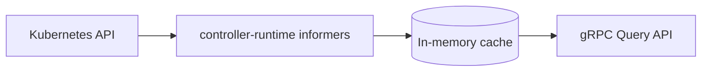

# Muninn

<p align="center">
  <picture>
    <source media="(prefers-color-scheme: dark)" srcset=".github/images/logo-dark.svg">
    <source media="(prefers-color-scheme: light)" srcset=".github/images/logo.svg">
    
  </picture>
</p>

<p align="center">
  <a href="https://github.com/Garoze/Muninn/actions/workflows/ci.yml"></a>
  <a href="./LICENSE"></a>
  <a href="./go.mod"></a>
</p>

**Kubernetes-native, multi-tenant runtime configuration discovery service.**

Muninn watches Kubernetes CRDs, projects them into an in-memory cache keyed
by tenant, and exposes that cache over a gRPC Query API. Downstream services
ask Muninn "give me these keys for this tenant" instead of reading
Kubernetes objects directly — Muninn is the only thing that needs to know
what a `Tenant`, `TenantConfig`, or `Policy` object looks like.



## Why this exists

Most services in a multi-tenant platform need the same handful of
per-tenant facts — display name, feature flags, provisioned cloud resource
IDs, JWT validation rules — and none of them should be reading CRDs
directly to get them. Muninn centralizes that: one service watches the
CRDs, normalizes them into a stable key namespace, and serves that
namespace over gRPC with a documented contract (`Describe`) and hard
whitelisting (unknown keys are rejected, not silently ignored).

## Architecture

Three CRDs, all under group `muninn.io`, namespace `tenant-<id>`:

| CRD            | Scope      | Purpose                                                                              |
|----------------|------------|--------------------------------------------------------------------------------------|
| `Tenant`       | Cluster    | Identity, lifecycle phase, provisioned cloud resource refs (`status.cloudResources`) |
| `TenantConfig` | Namespaced | Arbitrary `map[string]string` runtime config                                         |
| `Policy`       | Namespaced | JWT validation settings, subject/role → permission bindings                          |

| Package                   | Role                                                             |
|---------------------------|------------------------------------------------------------------|
| `internal/kube`           | controller-runtime informers, patch-based cache sync             |
| `internal/app`            | domain layer: `Cache`, `DiscoveryService.Query`, sentinel errors |
| `internal/transport/grpc` | proto ↔ domain translation, gRPC handler                         |
| `internal/observability`  | Prometheus metrics, health checks, gRPC server/listener          |
| `internal/config`         | env-driven configuration                                         |
| `api/v1alpha1`            | CRD Go types + generated deepcopy                                |
| `gen/discovery/v1`        | generated gRPC/protobuf stubs                                    |

`internal/app` has zero imports of `grpc`, `k8s.io/*`, or any generated
proto type — the domain layer only ever sees Go primitives and its own
structs. Both edges (`internal/kube` translating CRDs *in*, `internal/transport/grpc`
translating requests *out*) do the translation work; the domain package
stays ignorant of both.

## Design decisions

> [!NOTE]
> See [`docs/design.md`](docs/design.md) for the full rationale behind these
> and a few decisions not covered here (CRD field placement, the
> domain/transport boundary, error translation, and Fx wiring).

**Patch-based cache merge.** Each CRD owns its own slice of a tenant's
cached state — a `Policy` update never touches `TenantConfig` data, and
vice versa. Implemented via `applyPatch` in `internal/kube/watcher.go`,
where each informer handler only sets the `tenantPatch` fields it's
responsible for. Covered directly in `internal/kube/watcher_test.go`
(`TestApplyPatch_ResourceScopedMerge`).

**Readiness gating.** The gRPC health check stays `NOT_SERVING` until the
informer cache completes its initial list+watch cycle, so a pod never
serves traffic against an empty cache. Flipped via `MarkHealthServing`
once `Watcher.Start` confirms sync.

**Key whitelisting.** `internal/app.SupportedKeys` is the single source of
truth for what's queryable. A key not in that map returns
`InvalidArgument`, not an empty/silent response. `Describe` exposes the
full list with type hints, so consumers can discover the contract instead
of guessing at it.

**No interface between the gRPC handler and the domain service.** The
handler holds a concrete `*app.DiscoveryService`, not an interface. The
domain service is cheap and deterministic (in-memory map, no I/O) —
`internal/transport/grpc/handler_test.go` constructs a real one with
seeded cache state rather than mocking it. An interface would earn its
keep with a second implementation or an expensive dependency; neither
exists here.

## Getting started

### Prerequisites

- Go 1.26+
- A running Kubernetes cluster and `kubectl` pointed at it (developed
  against [k3s](https://k3s.io/); any cluster works)
- [`controller-gen`](https://github.com/kubernetes-sigs/controller-tools)
  on `PATH` (`go install sigs.k8s.io/controller-tools/cmd/controller-gen@latest`)
- [`grpcurl`](https://github.com/fullstorydev/grpcurl) (optional — for
  hitting the API directly instead of through `muninnctl`; the server
  registers gRPC reflection, so no `.proto` files are needed client-side)

### Install the CRDs

```bash
export KUBECONFIG=~/.kube/config   # or wherever your cluster's kubeconfig lives
make install-crds
```

Generates CRD manifests from the Go types in `api/v1alpha1` and applies
them.

### Apply the sample fixtures

```bash
make sample           # Namespace + Tenant + TenantConfig + Policy
make sample-status    # patches Tenant.status.cloudResources (a separate
                      # subresource — `kubectl apply` on spec alone can't
                      # touch it)
```

> [!NOTE]
> This creates a sample tenant (`arasaka`) with placeholder — not real —
> identity pool/storage bucket values, so you have something to query
> immediately.

### Run it

> [!IMPORTANT]
> `KUBE_CONFIG_PATH` is Muninn's own config variable, separate from
> `kubectl`'s `$KUBECONFIG` — setting one does not set the other.

```bash
export KUBE_CONFIG_PATH=~/.kube/config
make run
```

or directly:

```bash
KUBE_CONFIG_PATH=~/.kube/config go run ./cmd/muninn
```

On success you'll see structured logs for cache sync (`"informers synced
and watching"`) and the gRPC server binding `:5010` (configurable via
`GRPC_SERVICE_ADDR`).

### Query it

```bash
# discover the supported key namespace
make describe

# query specific keys for the sample tenant
make query TENANT=arasaka KEYS=TENANT.id,TENANT.displayName,TENANT.resources.identityPoolID
```

Or hit the API directly with `grpcurl`, since the server registers gRPC
reflection:

```bash
grpcurl -plaintext localhost:5010 discovery.v1.DiscoveryService/Describe

grpcurl -plaintext -d '{
  "tenant_id": "arasaka",
  "keys": ["TENANT.id", "TENANT.displayName", "TENANT.resources.identityPoolID"]
}' localhost:5010 discovery.v1.DiscoveryService/Query
```

Live cluster changes are reflected without restarting the process — try
`kubectl patch tenantconfig arasaka -n tenant-arasaka --type=merge -p
'{"spec":{"runtimeConfig":{"NEW_KEY":"value"}}}'` and re-run the `Query`
call for `TENANT.runtime`.

## Testing

```bash
make test-unit            # go test ./... -short — no cluster required
make test-integration     # go test ./... -tags=integration -run Integration
                          # requires KUBECONFIG; currently no tests are
                          # tagged `integration` yet (see Status)
make test                 # both
```

Unit coverage spans the domain layer (`internal/app`), the gRPC↔domain
translation boundary (`internal/transport/grpc`), the patch-merge/CRD
extraction logic (`internal/kube`), observability wiring
(`internal/observability`), and config parsing (`internal/config`) —
positive and negative cases for error precedence, label cardinality on
every Prometheus metric, nil-safety, and the resource-scoped merge
guarantee described above.

## Makefile reference

| Target                                         | Does                                                                      |
|------------------------------------------------|---------------------------------------------------------------------------|
| `make generate`                                | Regenerate deepcopy code from kubebuilder markers                         |
| `make install-crds`                            | Generate + apply CRD manifests to `$KUBECONFIG`                           |
| `make sample` / `make sample-status`           | Apply sample fixtures / patch sample status                               |
| `make run`                                     | Run the server locally against `$KUBECONFIG`                              |
| `make test` / `test-unit` / `test-integration` | Run tests                                                                 |
| `make query TENANT=<id> KEYS=<a,b,c>`          | Query keys for a tenant via `muninnctl`                                   |
| `make describe`                                | List supported configuration keys via `muninnctl`                         |
| `make fmt` / `vet` / `lint` / `tidy`           | Standard Go hygiene                                                       |
| `make proto`                                   | Regenerate gRPC stubs from `proto/v1/discovery.proto` (requires `protoc`) |
| `make build`                                   | Compile `cmd/` entrypoints into `bin/`                                    |

## Status

This is an actively developed portfolio project, not a finished product.
What's solid today: CRD watching, patch-based cache merge, the full gRPC
Query/Describe API, `muninnctl` (a kubectl-style CLI for `query`/`describe`),
Fx-based dependency wiring, and unit test coverage across every package.
What's still ahead:

- Integration tests against a real API server via
  [`envtest`](https://pkg.go.dev/sigs.k8s.io/controller-runtime/pkg/envtest)
  (`test/integration/envtest`), covering the informer registration/watch
  loop that today's unit tests deliberately don't reach
  (`internal/kube/watcher_test.go` covers the pure patch/extraction logic
  underneath it)
- Container image build (`Dockerfile` doesn't exist yet — `make
  image`/`load` are functional but have nothing to build without it)
- OpenTelemetry tracing (not yet a dependency)

## License

[MIT](./LICENSE)
