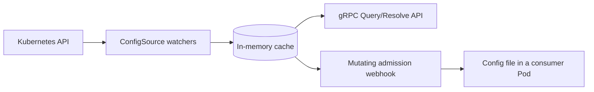

# Muninn

<p align="center">
  <picture>
    <source media="(prefers-color-scheme: dark)" srcset=".github/images/logo-dark.svg">
    <source media="(prefers-color-scheme: light)" srcset=".github/images/logo.svg">
    
  </picture>
</p>

<p align="center">
  <a href="https://github.com/Garoze/Muninn/actions/workflows/ci.yml"></a>
  <a href="./LICENSE"></a>
  <a href="./go.mod"></a>
</p>

**Kubernetes-native configuration cache and distribution layer.**

Muninn watches labeled ConfigMaps, merges them into a per-namespace view held
in memory, and distributes that view to workloads: over gRPC, or as a file
injected into a Pod by a mutating admission webhook. A configuration change
reaches a running Pod without a restart, and without that Pod integrating with
the Kubernetes API itself.



## Features

- **ConfigMap aggregation.** Watches ConfigMaps matching a configurable label
  selector, across namespaces, with no CRD to install.
- **Namespace-scoped in-memory cache.** Informer-backed and patch-merged, so a
  read costs no API server round trip and a change propagates within the watch
  layer's event latency.
- **gRPC discovery API.** `Query` for named keys, `Resolve` for a whole
  namespace, `Describe` for the active sources' shape. Server reflection is
  registered; TLS is opt-in.
- **Admission webhook injection.** An annotated Pod receives the resolved
  configuration as a file, kept current in place, with no client code in the
  workload.
- **Secret references.** Configuration carries references to secrets rather
  than values, which `secrets-store-csi-driver` resolves and mounts.
- **Metrics and tracing.** Prometheus metrics and an OpenTelemetry span for
  every gRPC call and admission request.

## Motivation

Reading a ConfigMap directly is the right answer for a single workload. That
approach stops scaling once many workloads share overlapping configuration,
because the cost is paid per workload rather than per unit of configuration:
each one needs Kubernetes API access, an RBAC grant to maintain, its own
merging logic for whatever layering it expects, and its own handling of the
reload lifecycle. A workload that keeps its view current also holds a watch, so
API server load grows with the size of the fleet as well.

Muninn moves that work behind one component. Informers hold the current state
in memory, so a read costs no API server round trip and a change propagates
within the watch layer's event latency. Consumers receive a merged
per-namespace view, over gRPC with a documented contract (`Describe`) or as a
file written into the Pod, which requires no Kubernetes integration in the
workload at all.

Namespace is the resolution scope because Kubernetes already treats it as a
boundary. It composes with a single namespace, one namespace per tenant, or a
consumer's own custom resource, without Muninn prescribing which.

## Architecture

The domain layer has no knowledge of Kubernetes or gRPC. Each edge translates
in its own direction, and the boundary is enforced structurally rather than by
convention.

- **Pluggable sources.** The watch layer, cache and domain layer are written
  against a `ConfigSource` interface rather than against `ConfigMap`. A
  bring-your-own custom resource registers as one more source; see
  [`docs/config-sources.md`](docs/config-sources.md).
- **Patch-based merge.** Each source object owns its own slice of a namespace's
  state, so one object's update never disturbs another's.
- **Readiness gating.** Reads remain unavailable until every registered
  source's informer completes its initial list and watch.
- **No admission-time dependency on the resolver.** The webhook runs its own
  watcher and cache, so a resolver outage cannot block Pod scheduling.
- **No fixed key vocabulary.** Muninn serves whatever keys the source data
  holds; `Describe` reports the sources' shape, not an enumerated key list.

[`docs/design.md`](docs/design.md) records the reasoning behind each, and
[`docs/adr/`](docs/adr/) the decisions with the largest tradeoffs.

## Quick start

### Prerequisites

- Go 1.26+
- `make`
- A Kubernetes cluster and `kubectl` configured to reach it (developed against
  [k3s](https://k3s.io/))

Optional dependencies, which Muninn does not install:

| Dependency | Required for |
|---|---|
| [cert-manager](https://cert-manager.io/) | `make deploy-webhook` |
| [`secrets-store-csi-driver`](https://secrets-store-csi-driver.sigs.k8s.io/) and [Vault](https://www.vaultproject.io/) | [Secret references](#secret-references) |
| [`setup-envtest`](https://pkg.go.dev/sigs.k8s.io/controller-runtime/tools/setup-envtest) | `make test-integration` |
| [`grpcurl`](https://github.com/fullstorydev/grpcurl) | Calling the API without `muninnctl` |
| [`helm`](https://helm.sh/) | `make test-integration`, `make test-e2e`, `make test-e2e-csi` |
| [`kind`](https://kind.sigs.k8s.io/) and a container engine | `make test-e2e-csi` |

### Run it

```bash
make sample   # create the arasaka namespace and a labeled ConfigMap
make run      # run the resolver against $KUBECONFIG; gRPC on :5010
```

`make sample` installs no CRDs; Muninn watches core `ConfigMap` objects
labeled `muninn.io/config: "runtime"`. Once the logs report that the informers
have synced, query it from a second shell:

```bash
make describe                                  # active configuration sources
make query NAMESPACE=arasaka KEYS=LOG_LEVEL    # resolve keys
```

Edits reach the cache without a restart:

```bash
kubectl patch configmap runtime-config -n arasaka --type=merge \
  -p '{"data":{"LOG_LEVEL":"debug"}}'
make query NAMESPACE=arasaka KEYS=LOG_LEVEL
```

Running Muninn in-cluster and delivering configuration into Pods is covered in
[`docs/deployment.md`](docs/deployment.md). Calling the API without
`muninnctl` is covered in [`docs/api.md`](docs/api.md).

### Published chart

The chart is published as an OCI artifact, so there is no `helm repo add` step:

```bash
helm install muninn oci://ghcr.io/garoze/charts/muninn \
  --namespace muninn-system --create-namespace
```

This is the chart's default and assumes cert-manager is already installed
(see [Prerequisites](#prerequisites)) - the common case. If it isn't:
`--set certificate.mode=self-signed` needs no external dependency at all, and
`--set cert-manager.enabled=true --set secrets-store-csi-driver.enabled=true`
has the chart install its own cert-manager/CSI driver dependencies (a
two-phase install; `values.yaml` documents the exact sequence). A `provided`
mode covers bringing your own PKI. `helm show values
oci://ghcr.io/garoze/charts/muninn` documents every option.

The chart and image are both signed with [cosign](https://github.com/sigstore/cosign)
under this repository's own GitHub Actions identity.

## Delivering config as a file

A mutating admission webhook resolves a namespace at Pod admission and writes
the result to a volume the Pod's own containers mount. The application reads
`/etc/muninn/config.yaml`; a sidecar refreshes that file in place as
configuration changes, so no restart and no gRPC client are involved. A Pod
opts in through an annotation, and nothing else in its spec changes:

```yaml
metadata:
  annotations:
    muninn.io/inject: "true"
```

The webhook runs its own watcher and cache rather than calling the resolver,
so an admission request depends only on the Kubernetes API and the webhook's
own process. See [`docs/deployment.md`](docs/deployment.md) to deploy it and
[ADR-0010](docs/adr/0010-single-process-webhook.md) for the availability
boundary.

## Secret references

Muninn does not deliver secrets, and never holds a secret value. Configuration
carries a *reference* to one, and
[`secrets-store-csi-driver`](https://secrets-store-csi-driver.sigs.k8s.io/)
fetches and mounts the value into the Pod directly:

```yaml
data:
  db_password_ref: "vault://secret/data/arasaka/db-password"
```

At admission the webhook translates every reference in a namespace into a
`SecretProviderClass` describing what the driver should fetch, and injects a
volume backed by that driver. The value transits the driver and the kubelet,
never the cache the gRPC API serves, which performs no caller authentication
on the premise that nothing flowing through it grants access to anything else.

The reference convention, its optional companion keys, and the cluster
prerequisites are documented in
[`docs/secret-references.md`](docs/secret-references.md).
[ADR-0012](docs/adr/0012-csi-secret-delivery.md) covers the trust boundary,
with a diagram.

## Configuration

Every setting is an environment variable with a default. The most commonly
used:

| Variable | Default | Purpose |
|---|---|---|
| `CONFIGMAP_LABEL_SELECTOR` | `muninn.io/config=runtime` | Scopes which ConfigMaps are watched. |
| `GRPC_SERVICE_ADDR` | `:5010` | gRPC API bind address. |
| `MUNINN_INJECT_IMAGE` | *(required by `webhook`)* | Image stamped onto injected containers. |
| `SECRET_SPC_MODE` | `Create` | Whether the webhook generates the `SecretProviderClass` or only validates a pre-provisioned one. |

Full reference, including TLS and tracing settings:
[`docs/configuration.md`](docs/configuration.md).

## Observability

Prometheus metrics on `$METRICS_ADDR` (default `:9090`), and an OpenTelemetry
span for every gRPC call and admission request exported over OTLP. Nothing
needs to be listening for Muninn to run.

[`docs/observability.md`](docs/observability.md) covers the signals, the health
endpoints, and a local Jaeger walkthrough.

## Testing

```bash
make test-unit          # no cluster required
make test-integration   # envtest: a throwaway etcd + kube-apiserver
make test               # both, and what CI runs
```

Behavior that only appears against a real control plane is tested against one:
the integration tier runs on `envtest`, and two end-to-end tiers deploy through
the same targets an operator uses. Neither end-to-end tier runs in CI, since
both need a real cluster for signal that changes only when the deployment path
does. [`docs/testing.md`](docs/testing.md) covers each tier, what it verifies,
and how to run it.

## Documentation

`make help` lists every available target. [`docs/`](docs/) contains the
deployment, API, configuration, observability and testing guides, the design
rationale, and Architecture Decision Records.

## Status

Muninn is a portfolio project and reference implementation, not an operated
service. It has not been deployed in production, does not provide API
stability guarantees, and has no formal release or support process. Its design
is based on patterns used in a production platform, generalized so that it
does not depend on that platform or its environment.

## Contributing

Issues and pull requests are welcome.
[`CONTRIBUTING.md`](CONTRIBUTING.md) documents the development workflow,
commit conventions, and CI checks.

The current implementation covers the scope this project set out to
demonstrate, so a large feature addition is worth raising in an issue before
writing it: some are a better fit for a fork than for a change here. Bug
reports are always welcome, particularly from anyone running Muninn against a
real cluster, and are investigated on a best-effort basis.

## License

[MIT](./LICENSE)
