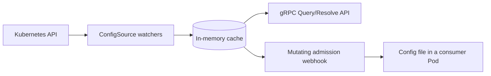

# Muninn

<p align="center">
  <picture>
    <source media="(prefers-color-scheme: dark)" srcset=".github/images/logo-dark.svg">
    <source media="(prefers-color-scheme: light)" srcset=".github/images/logo.svg">
    
  </picture>
</p>

<p align="center">
  <a href="https://github.com/Garoze/Muninn/actions/workflows/ci.yml"></a>
  <a href="./LICENSE"></a>
  <a href="./go.mod"></a>
</p>

**Kubernetes-native runtime configuration resolver.**

Muninn resolves runtime configuration for workloads running in Kubernetes.
It watches labeled ConfigMaps, keeps a merged per-namespace view in memory,
and serves that view over gRPC.

A mutating admission webhook delivers the same view into a Pod as a file, so
a workload can consume it with no client code at all. Either way, a
configuration change reaches a running Pod without a restart, and without
that Pod holding a watch against the API server.



## Motivation

A workload can read its own ConfigMap directly, and for a single workload
that is usually the right answer. It stops scaling once many workloads need
overlapping configuration: each one needs a Kubernetes client, its own RBAC,
and its own watch against the API server, so read load and watch connections
grow with the size of the fleet rather than with the amount of data.

Muninn collapses that to one watcher. Informers hold the current state in
memory, so a read costs no API server round trip and a change propagates
within the watch layer's event latency. Consumers get a merged per-namespace
view, either over gRPC with a documented contract (`Describe`) or as a file
written into the Pod.

Namespace is the resolution scope because it is a boundary Kubernetes already
has. That composes with a single namespace, one namespace per tenant, or a
consumer's own custom resource, without Muninn dictating which.

## Architecture

| Package | Role |
|---|---|
| `internal/kube` | `ConfigSource` interface and `ConfigMapSource`, informers, patch-based cache sync |
| `internal/app` | domain layer: `Cache`, `DiscoveryService`, sentinel errors |
| `internal/transport/grpc` | proto and domain translation, gRPC handler, server, listener, TLS |
| `internal/webhook` | admission webhook: injection patch, secret references, `SecretProviderClass`, HTTPS server |
| `internal/discoveryclient` | shared gRPC dial helper |
| `internal/observability` | metrics, tracing, health |
| `internal/config` | env-driven configuration |

The domain layer knows nothing about Kubernetes or gRPC; each edge translates
in its own direction, and that boundary is enforced structurally rather than by
convention.

Design principles:

- **Pluggable sources.** The watch layer, cache and domain layer are written
  against a `ConfigSource` interface, not against `ConfigMap`. A
  bring-your-own custom resource registers as one more source.
- **Patch-based merge.** Each source object owns its own slice of a namespace's
  state, so one object's update never disturbs another's.
- **Readiness gating.** Reads stay unavailable until every registered source's
  informer finishes its initial list and watch.
- **No admission-time dependency on the resolver.** The webhook runs its own
  watcher and cache, so a resolver outage cannot block Pod scheduling.
- **No fixed key vocabulary.** Muninn serves whatever keys the source data
  holds; `Describe` reports the sources' shape, not an enumerated key list.

[`docs/design.md`](docs/design.md) has the reasoning behind each, and
[`docs/adr/`](docs/adr/) records the decisions with the largest tradeoffs.

## Getting started

### Prerequisites

- Go 1.26+, `make`, and a Kubernetes cluster with `kubectl` pointed at it
  (developed against [k3s](https://k3s.io/); any cluster works)

Optional, depending on what you run:

| For | You also need |
|---|---|
| `make deploy-webhook` | [cert-manager](https://cert-manager.io/), which issues the webhook's serving certificate |
| Secret delivery | [`secrets-store-csi-driver`](https://secrets-store-csi-driver.sigs.k8s.io/) and [Vault](https://www.vaultproject.io/) |
| `make test-integration` | [`setup-envtest`](https://pkg.go.dev/sigs.k8s.io/controller-runtime/tools/setup-envtest), then `export KUBEBUILDER_ASSETS=$(setup-envtest use -p path)` |
| Calling the API without `muninnctl` | [`grpcurl`](https://github.com/fullstorydev/grpcurl); the server registers reflection, so no `.proto` files are needed |

Muninn orchestrates cert-manager and the CSI driver but installs neither.

### Apply the sample fixtures

```bash
export KUBECONFIG=~/.kube/config   # or wherever the cluster's kubeconfig lives
make sample                        # Namespace + a labeled ConfigMap
```

> [!NOTE]
> This creates a sample namespace (`arasaka`) with a ConfigMap labeled
> `muninn.io/config: "runtime"` and a couple of example `data` keys, so
> there is data to query without further setup. No CRD installation is
> required: Muninn watches core `ConfigMap` objects.

### Run it

```bash
make run
```

That reads `~/.kube/config`, or `$KUBECONFIG` if you have one set elsewhere.
Muninn logs that its informers have synced, then binds the gRPC server on
`:5010`.

Running the binary without `make` takes Muninn's own variable, which is
separate from `kubectl`'s:

```bash
KUBE_CONFIG_PATH=~/.kube/config go run ./cmd/muninn serve
```

### Query it

```bash
# list the active config sources
make describe

# query specific keys for the sample namespace
make query NAMESPACE=arasaka KEYS=LOG_LEVEL,FEATURE_DARKMODE
```

Or call the API directly with `grpcurl`, since the server registers gRPC
reflection:

```bash
grpcurl -plaintext localhost:5010 discovery.v1.DiscoveryService/Describe

grpcurl -plaintext -d '{
  "namespace": "arasaka",
  "keys": ["LOG_LEVEL", "FEATURE_DARKMODE"]
}' localhost:5010 discovery.v1.DiscoveryService/Query
```

Live cluster changes are reflected without restarting the process: try
`kubectl patch configmap runtime-config -n arasaka --type=merge -p
'{"data":{"LOG_LEVEL":"debug"}}'` and re-run the `Query` call.

## Deployment

`make run` runs Muninn on the host against whatever `$KUBECONFIG` points at,
which suits development rather than production. `make deploy` runs it as a Pod
instead, under its own least-privilege `ServiceAccount`:

```bash
make image      # build the image
make load       # import it into k3s's containerd store
make deploy     # apply config/manager/ + config/rbac/
```

> [!NOTE]
> `make load` imports into k3s specifically. On another cluster, get
> `localhost/muninn:latest` onto the nodes however that cluster expects
> (`minikube image load`, `kind load image-archive` after a `podman save`, or
> a push to a registry the cluster can reach), then run `make deploy`.

```bash
kubectl get pods -n muninn-system   # should reach 1/1 Running
kubectl port-forward -n muninn-system deploy/muninn 5010:5010 &
make query NAMESPACE=arasaka KEYS=LOG_LEVEL
```

`make undeploy` tears it back down.

### Delivering config as a file (the admission webhook)

`make deploy` covers the gRPC API only. The webhook is a separate deployment:

```bash
make deploy-webhook     # apply config/webhook/: Issuer, Certificate,
                        # Service, Deployment, MutatingWebhookConfiguration
```

Annotate any Pod to opt in. Nothing else in its spec needs to change:

```yaml
metadata:
  annotations:
    muninn.io/inject: "true"
```

At admission, the webhook injects a shared volume, an init container that
resolves the Pod's namespace once, and a sidecar that keeps the file
current on an interval, and mounts that volume into the Pod's own
container too, so the application reads `/etc/muninn/config.yaml`
directly with no gRPC client of its own. `make undeploy-webhook` tears it
back down.

### Delivering secrets

Muninn never carries a secret value. A ConfigMap holds a *reference* to one,
and the CSI driver fetches it straight into the Pod.

A reference is a key ending in `_ref`. Two optional keys sharing its prefix
refine it:

```yaml
data:
  db_password_ref:  "vault://secret/data/arasaka/db-password"  # required
  db_password_key:  "value"                                    # optional
  db_password_file: "/mnt/secrets-store/db_password"           # optional
```

- **`_ref`** names where the secret lives. At admission the webhook derives a
  `SecretProviderClass` from every `_ref` in the namespace, describing what the
  driver should fetch. It never reads the value itself.
- **`_key`** picks one field out of the secret at that path. Without it the
  mounted file holds the whole response as JSON.
- **`_file`** records where the value will land, for your own reference only.
  Muninn does not read it. The real path is always `/mnt/secrets-store/`
  followed by the `_ref` key with `_ref` stripped.

A Pod opts in with the same `muninn.io/inject: "true"` annotation. It also
needs its `ServiceAccount` bound to a role in the secret store, set up once per
namespace rather than once per secret. The application then reads files:

```bash
cat /etc/muninn/config.yaml         # config, as before
cat /mnt/secrets-store/db_password  # the secret value
```

> [!NOTE]
> A CSI mount is fixed for the Pod's lifetime, so a reference added to a
> running Pod's ConfigMap cannot be applied retroactively. The sidecar logs it
> and emits an `Event` where RBAC allows (`make sample-events`); acting on it
> means restarting the Pod.

[ADR-0012](docs/adr/0012-csi-secret-delivery.md) covers why secrets flow
through the driver and never through Muninn, with a trust-boundary diagram.
`SECRET_SPC_MODE` decides whether the webhook creates that
`SecretProviderClass` or only validates one you pre-provision.

## Configuration

Every setting is an environment variable with a default. The ones most
deployments touch:

| Variable | Default | Purpose |
|---|---|---|
| `CONFIGMAP_LABEL_SELECTOR` | `muninn.io/config=runtime` | Scopes which ConfigMaps are watched. |
| `GRPC_SERVICE_ADDR` | `:5010` | gRPC API bind address. |
| `MUNINN_INJECT_IMAGE` | *(required by `webhook`)* | Image stamped onto injected containers. |
| `SECRET_SPC_MODE` | `Create` | Whether the webhook generates the `SecretProviderClass` or only validates a pre-provisioned one. |

Full reference, including TLS and tracing settings:
[`docs/configuration.md`](docs/configuration.md).

## Observability

Prometheus metrics on `$METRICS_ADDR` (default `:9090`), and an OpenTelemetry
span for every gRPC call and admission request exported over OTLP. Nothing
needs to be listening for Muninn to run.

[`docs/observability.md`](docs/observability.md) covers the signals, the health
endpoints, and a local Jaeger walkthrough.

## Testing

```bash
make test-unit          # no cluster required
make test-integration   # envtest: a throwaway etcd + kube-apiserver
make test               # both, and what CI runs
```

Unit tests cover the domain layer, the gRPC translation boundary, the
watch-and-patch logic, observability wiring and configuration parsing. The
integration tier runs against a real API server via `envtest`.

### End-to-end tests

Two end-to-end tiers exist, and neither runs in CI. Both need a real cluster,
and the CSI tier provisions its own with `kind`, `helm` and a container engine.
Running them per commit would cost minutes of wall time for signal that only
changes when the deployment path does, so they run on demand.

```bash
make image load         # `make load` needs interactive sudo
make test-e2e           # against a cluster you already have

make test-e2e-csi       # provisions a disposable kind cluster, then tears it down
```

`make test-e2e` deploys through the same targets a person would run by hand,
then checks the gRPC API, injection into an annotated Pod, and that a ConfigMap
edit reaches the mounted file without a restart. `make test-e2e-csi` adds the
CSI path: a webhook-generated `SecretProviderClass`, a real Vault secret and
the config file in one Pod, and the sidecar reporting a new reference.

Two narrower claims stay manual: that an *unannotated* Pod schedules untouched,
and that `failurePolicy: Fail` does not affect unrelated Pods.
[`docs/design.md`](docs/design.md) explains why.

## Documentation

`make help` lists every target. [`docs/`](docs/) covers configuration,
observability, the design rationale and the Architecture Decision Records.

## Status

Muninn is a reference implementation, not an operated service. It has not been
deployed in production, carries no API stability guarantee, and has no release
or support process. The design reflects patterns used in a production platform,
generalized so that nothing about that platform is assumed here.

Everything the documentation describes is implemented and tested. Unit and
integration tiers run in CI; the two end-to-end tiers need a real cluster and
are run on demand, as described under [Testing](#testing).

## Contributing

Issues and pull requests are welcome. [`CONTRIBUTING.md`](CONTRIBUTING.md)
documents the workflow, the commit convention, and what CI checks.

## License

[MIT](./LICENSE)
