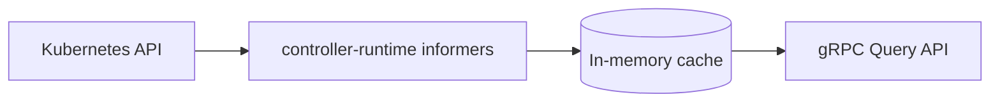

# Muninn

<p align="center">
  <picture>
    <source media="(prefers-color-scheme: dark)" srcset=".github/images/logo-dark.svg">
    <source media="(prefers-color-scheme: light)" srcset=".github/images/logo.svg">
    
  </picture>
</p>

<p align="center">
  <a href="https://github.com/Garoze/Muninn/actions/workflows/ci.yml"></a>
  <a href="./LICENSE"></a>
  <a href="./go.mod"></a>
</p>

**Kubernetes-native runtime configuration resolver.**

Muninn watches Kubernetes ConfigMaps (scoped by a label selector), projects
them into an in-memory cache keyed by namespace, and exposes that cache over
a gRPC Query API. Downstream services query Muninn for a set of keys scoped
to a namespace instead of reading Kubernetes objects directly. Muninn makes
no assumptions about what those keys mean, what a "tenant" is, or what
platform sits underneath it — it resolves configuration, nothing more.



## Motivation

Most services in a Kubernetes-native platform need the same handful of
per-namespace configuration values, and none of them should read ConfigMaps
directly to get them — that couples every consumer to a naming convention
and a Kubernetes client. Muninn centralizes that: one service watches
labeled ConfigMaps, merges them into a per-namespace view, and serves that
view over gRPC with a documented contract (`Describe`).

A namespace is a natural, generic scope — it composes cleanly with a
single-tenant deployment (one ConfigMap in `default`), a multi-tenant one
(a ConfigMap per tenant namespace, as in the
[multi-tenant usage example](#multi-tenant-usage-an-example-not-a-requirement)
below), or a consumer's own custom resource, without Muninn dictating which.

## Architecture

| Package                   | Role                                                              |
|---------------------------|--------------------------------------------------------------------|
| `internal/kube`           | controller-runtime informers, patch-based cache sync              |
| `internal/app`            | domain layer: `Cache`, `DiscoveryService.Query`, sentinel errors   |
| `internal/transport/grpc` | proto ↔ domain translation, gRPC handler                          |
| `internal/observability`  | Prometheus metrics, health checks, gRPC server/listener            |
| `internal/config`         | env-driven configuration                                            |
| `gen/discovery/v1`        | generated gRPC/protobuf stubs                                       |

The domain layer is decoupled from both Kubernetes and gRPC specifics —
each edge translates in its own direction, and the domain package itself
has no knowledge of either. See [`docs/design.md`](docs/design.md) for
why, and how that boundary is enforced.

Three design principles underpin the implementation:

- **Patch-based cache merge** — each ConfigMap owns its own slice of a
  namespace's cached state, so one ConfigMap's update never touches
  another's data in the same namespace.
- **Readiness gating** — the gRPC health check stays `NOT_SERVING` until
  the informer cache completes its initial list+watch cycle.
- **No fixed key vocabulary** — Muninn serves whatever keys exist in the
  resolved ConfigMap data; `Describe` reports the active config source
  (kind, label selector, scope) rather than an enumerated key list, since
  the data itself is open-ended.

See [`docs/design.md`](docs/design.md) for the rationale behind these and
other design decisions.

## Getting started

### Prerequisites

- Go 1.26+
- `make`
- A running Kubernetes cluster and `kubectl` pointed at it (developed
  against [k3s](https://k3s.io/); any cluster works)
- [`grpcurl`](https://github.com/fullstorydev/grpcurl) (optional — for
  calling the API directly instead of through `muninnctl`; the server
  registers gRPC reflection, so no `.proto` files are needed client-side)
- [`setup-envtest`](https://pkg.go.dev/sigs.k8s.io/controller-runtime/tools/setup-envtest)
  (only for `make test-integration`) —
  `go install sigs.k8s.io/controller-runtime/tools/setup-envtest@latest`, then
  `export KUBEBUILDER_ASSETS=$(setup-envtest use -p path)`. Downloads a
  throwaway `etcd`/`kube-apiserver` pair; doesn't touch the real cluster.

### Apply the sample fixtures

```bash
export KUBECONFIG=~/.kube/config   # or wherever the cluster's kubeconfig lives
make sample                        # Namespace + a labeled ConfigMap
```

> [!NOTE]
> This creates a sample namespace (`arasaka`) with a ConfigMap labeled
> `muninn.io/config: "runtime"` and a couple of example `data` keys, so
> there is data to query without further setup. No CRD installation is
> required — Muninn watches core `ConfigMap` objects.

### Run it

> [!IMPORTANT]
> `KUBE_CONFIG_PATH` is Muninn's own config variable, separate from
> `kubectl`'s `$KUBECONFIG` — setting one does not set the other.

```bash
export KUBE_CONFIG_PATH=~/.kube/config
make run
```

or directly:

```bash
KUBE_CONFIG_PATH=~/.kube/config go run ./cmd/muninn
```

On success, structured logs report cache sync (`"informers synced and
watching"`) and the gRPC server binding `:5010` (configurable via
`GRPC_SERVICE_ADDR`).

### Query it

```bash
# list the active config sources
make describe

# query specific keys for the sample namespace
make query NAMESPACE=arasaka KEYS=LOG_LEVEL,FEATURE_DARKMODE
```

Or call the API directly with `grpcurl`, since the server registers gRPC
reflection:

```bash
grpcurl -plaintext localhost:5010 discovery.v1.DiscoveryService/Describe

grpcurl -plaintext -d '{
  "namespace": "arasaka",
  "keys": ["LOG_LEVEL", "FEATURE_DARKMODE"]
}' localhost:5010 discovery.v1.DiscoveryService/Query
```

Live cluster changes are reflected without restarting the process — try
`kubectl patch configmap runtime-config -n arasaka --type=merge -p
'{"data":{"LOG_LEVEL":"debug"}}'` and re-run the `Query` call.

## Deployment

`make run` runs Muninn on the host, against whatever `$KUBECONFIG` is
configured — suited to development, not production. `make deploy` runs it
as a Pod instead, under its own least-privilege `ServiceAccount`:

```bash
make image      # build the image
make load       # import it into k3s's containerd store
make deploy     # apply config/manager/ + config/rbac/
```

```bash
kubectl get pods -n muninn-system   # should reach 1/1 Running
kubectl port-forward -n muninn-system deploy/muninn 5010:5010 &
make query NAMESPACE=arasaka KEYS=LOG_LEVEL
```

`make undeploy` tears it back down. See [`docs/design.md`](docs/design.md)
for the RBAC and deployment rationale.

### Multi-tenant usage (an example, not a requirement)

Muninn's core scope is a single label selector across namespaces — it has
no built-in notion of a tenant and imposes no namespace naming convention.
A namespace-per-tenant pattern, common in multi-tenant Kubernetes platforms,
composes with that directly: give each tenant its own namespace (named
however the platform names them — nothing below depends on a particular
scheme), place a `muninn.io/config: "runtime"`-labeled ConfigMap in each,
and query by that namespace:

```bash
kubectl create namespace acme
kubectl apply -f - <<'EOF'
apiVersion: v1
kind: ConfigMap
metadata:
  name: runtime-config
  namespace: acme
  labels:
    muninn.io/config: "runtime"
data:
  FEATURE_DARKMODE: "false"
EOF

make query NAMESPACE=acme KEYS=FEATURE_DARKMODE
```

A second tenant (`globex`, or anything else) is the same ConfigMap shape in
a different namespace — Muninn's cache is keyed by namespace regardless of
what a given deployment chooses to call it.

## Observability

Muninn exports an OpenTelemetry span for every gRPC call over OTLP to
`$OTEL_EXPORTER_OTLP_ENDPOINT` (default `localhost:4317`). Nothing needs to
be listening there for Muninn to run — spans fail to export silently if
the endpoint is unset or unreachable. To see them, run
[Jaeger](https://www.jaegertracing.io/)'s all-in-one image, which bundles
the collector, storage, and UI in one container:

```bash
podman run -d --name jaeger \
  -p 16686:16686 -p 4317:4317 \
  docker.io/jaegertracing/all-in-one:latest
# (or `docker run` in place of `podman run` — same image, same flags)
```

Then run Muninn pointed at it and issue a query:

> [!IMPORTANT]
> The default sample ratio is `0.1`, so a single manual query has only a
> 10% chance of being recorded. Set `OTEL_TRACES_SAMPLE_ARG=1` to sample
> every call for this walkthrough — otherwise Jaeger may show nothing.

```bash
export OTEL_EXPORTER_OTLP_ENDPOINT=localhost:4317
export OTEL_TRACES_SAMPLE_ARG=1
make run
```

```bash
make query NAMESPACE=arasaka KEYS=LOG_LEVEL
```

Open `http://localhost:16686`, select the `muninn` service, and find the
trace for that `Query` call.

## Testing

```bash
make test-unit             # go test ./... -short — no cluster required
make test-integration      # runs test/integration/envtest against a local,
                           # throwaway control plane (etcd + kube-apiserver) —
                           # not the real cluster. Requires KUBEBUILDER_ASSETS;
                           # see Prerequisites.

make test                  # both

make test-e2e              # deploys against the real cluster via `make
                           # deploy`, exercises it over gRPC, tears down via
                           # `make undeploy`. Requires the image already
                           # built and loaded (`make image load`). Not part
                           # of `make test` or CI — see docs/design.md.
```

Unit tests cover the domain layer, the gRPC translation boundary, the
Kubernetes watch-and-patch logic, observability wiring, and configuration
parsing — including negative-path and edge-case coverage alongside the
happy path, not only the resource-scoped merge guarantee described above.

## Makefile reference

| Target                                         | Does                                                                      |
|------------------------------------------------|---------------------------------------------------------------------------|
| `make sample`                                  | Apply the sample Namespace + labeled ConfigMap                            |
| `make run`                                     | Run the server locally against `$KUBECONFIG`                              |
| `make test` / `test-unit` / `test-integration` | Run tests                                                                 |
| `make test-e2e`                                | Deploy + exercise + tear down against the real cluster (not part of `make test`) |
| `make query NAMESPACE=<ns> KEYS=<a,b,c>`       | Query keys for a namespace via `muninnctl`                                |
| `make describe`                                | List the active configuration sources via `muninnctl`                     |
| `make fmt` / `vet` / `lint` / `tidy`           | Standard Go hygiene                                                       |
| `make proto`                                   | Regenerate gRPC stubs from `proto/v1/discovery.proto` (requires `protoc`) |
| `make build`                                   | Compile `cmd/` entrypoints into `bin/`                                    |
| `make image` / `load`                          | Build the container image / import it into k3s's containerd store        |
| `make deploy` / `undeploy`                     | Apply / tear down Muninn in-cluster under its own ServiceAccount          |

## Documentation

[`docs/design.md`](docs/design.md) covers the full rationale behind every
design decision referenced above: CRD field placement, the domain/transport
boundary, error translation, Fx wiring, in-cluster RBAC, the end-to-end
test, and OpenTelemetry tracing.

[`docs/adr/`](docs/adr/) records the decisions with the most significant
tradeoffs as standalone Architecture Decision Records.

## Status

Muninn is a portfolio project, not deployed in production. Its design
reflects patterns used in a production multi-tenant platform, generalized
into a standalone config resolver with no platform assumptions baked in.
Feature-complete for its current scope:

- ConfigMap watching (label-selector scoped), patch-based cache merge across sources
- The full gRPC Query/Describe API
- `muninnctl` — a kubectl-style CLI for `query`/`describe`
- A container image (multi-stage, distroless, verified end-to-end into a local k3s node)
- In-cluster deployment under a least-privilege `ServiceAccount` (`config/manager/`, `config/rbac/`)
- Integration tests against a real API server via [`envtest`](https://pkg.go.dev/sigs.k8s.io/controller-runtime/pkg/envtest) (also wired into CI)
- An end-to-end deployment test against a real cluster (`test/e2e`, local-only — see `docs/design.md` for why it's not in CI)
- OpenTelemetry tracing on every gRPC call, `ParentBased` sampling, with a Jaeger walkthrough for viewing it (see `docs/design.md`)
- Fx-based dependency wiring and unit test coverage across every package

Planned next: a pluggable config-source interface for bring-your-own config
CRDs, and a mutating admission webhook that delivers resolved config to a
pod's filesystem with live reload, so consumers don't need a gRPC client at
all.

## License

[MIT](./LICENSE)
