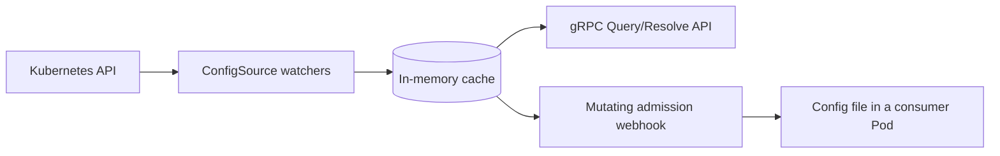

# Muninn

<p align="center">
  <picture>
    <source media="(prefers-color-scheme: dark)" srcset=".github/images/logo-dark.svg">
    <source media="(prefers-color-scheme: light)" srcset=".github/images/logo.svg">
    
  </picture>
</p>

<p align="center">
  <a href="https://github.com/Garoze/Muninn/actions/workflows/ci.yml"></a>
  <a href="./LICENSE"></a>
  <a href="./go.mod"></a>
</p>

**Kubernetes-native runtime configuration resolver.**

Muninn resolves runtime configuration for workloads running in Kubernetes.
It watches labeled ConfigMaps, keeps a merged per-namespace view in memory,
and serves that view over gRPC.

A mutating admission webhook delivers the same view into a Pod as a file,
allowing a workload to consume it without client code. In both cases a
configuration change reaches a running Pod without a restart, and without that
Pod holding a watch against the API server.



## Motivation

Reading a ConfigMap directly is the right answer for a single workload. It
stops scaling once many workloads share overlapping configuration: each
requires a Kubernetes client, its own RBAC, and its own watch, so read load and
watch connections grow with the size of the fleet rather than with the amount
of data.

Muninn reduces that to one watcher. Informers hold the current state in memory,
so a read costs no API server round trip and a change propagates within the
watch layer's event latency. Consumers receive a merged per-namespace view,
over gRPC with a documented contract (`Describe`) or as a file written into the
Pod.

Namespace is the resolution scope because Kubernetes already treats it as a
boundary. It composes with a single namespace, one namespace per tenant, or a
consumer's own custom resource, without Muninn prescribing which.

## Architecture

| Package | Role |
|---|---|
| `internal/kube` | `ConfigSource` interface and `ConfigMapSource`, informers, patch-based cache sync |
| `internal/app` | domain layer: `Cache`, `DiscoveryService`, sentinel errors |
| `internal/transport/grpc` | proto and domain translation, gRPC handler, server, listener, TLS |
| `internal/webhook` | admission webhook: injection patch, secret references, `SecretProviderClass`, HTTPS server |
| `internal/discoveryclient` | shared gRPC dial helper |
| `internal/observability` | metrics, tracing, health |
| `internal/config` | env-driven configuration |

The domain layer has no knowledge of Kubernetes or gRPC. Each edge translates
in its own direction, and the boundary is enforced structurally rather than by
convention.

Design principles:

- **Pluggable sources.** The watch layer, cache and domain layer are written
  against a `ConfigSource` interface rather than against `ConfigMap`. A
  bring-your-own custom resource registers as one more source.
- **Patch-based merge.** Each source object owns its own slice of a namespace's
  state, so one object's update never disturbs another's.
- **Readiness gating.** Reads remain unavailable until every registered
  source's informer completes its initial list and watch.
- **No admission-time dependency on the resolver.** The webhook runs its own
  watcher and cache, so a resolver outage cannot block Pod scheduling.
- **No fixed key vocabulary.** Muninn serves whatever keys the source data
  holds; `Describe` reports the sources' shape, not an enumerated key list.

[`docs/design.md`](docs/design.md) records the reasoning behind each, and
[`docs/adr/`](docs/adr/) the decisions with the largest tradeoffs.

## Getting started

### Prerequisites

- Go 1.26+
- `make`
- A Kubernetes cluster and `kubectl` configured to reach it (developed against
  [k3s](https://k3s.io/))

Optional dependencies, which Muninn does not install:

| Dependency | Required for |
|---|---|
| [cert-manager](https://cert-manager.io/) | `make deploy-webhook` |
| [`secrets-store-csi-driver`](https://secrets-store-csi-driver.sigs.k8s.io/) and [Vault](https://www.vaultproject.io/) | Delivering secrets |
| [`setup-envtest`](https://pkg.go.dev/sigs.k8s.io/controller-runtime/tools/setup-envtest) | `make test-integration` |
| [`grpcurl`](https://github.com/fullstorydev/grpcurl) | Calling the API without `muninnctl` |

### Apply the sample fixtures

```bash
make sample
```

This creates the `arasaka` namespace and a ConfigMap labeled
`muninn.io/config: "runtime"` to query against. No CRD installation is
required; Muninn watches core `ConfigMap` objects.

### Run it

```bash
make run
```

This reads `$KUBECONFIG`, defaulting to `~/.kube/config`. Muninn logs that its
informers have synced, then binds the gRPC server on `:5010`.

Running the binary directly requires `KUBE_CONFIG_PATH`, which is separate from
`kubectl`'s `$KUBECONFIG`:

```bash
KUBE_CONFIG_PATH=~/.kube/config go run ./cmd/muninn serve
```

### Query it

```bash
# list the active config sources
make describe

# query specific keys for the sample namespace
make query NAMESPACE=arasaka KEYS=LOG_LEVEL,FEATURE_DARKMODE
```

The server registers gRPC reflection, so `grpcurl` needs no `.proto` files:

```bash
grpcurl -plaintext localhost:5010 discovery.v1.DiscoveryService/Describe

grpcurl -plaintext -d '{
  "namespace": "arasaka",
  "keys": ["LOG_LEVEL", "FEATURE_DARKMODE"]
}' localhost:5010 discovery.v1.DiscoveryService/Query
```

Edits reach the cache without a restart:

```bash
kubectl patch configmap runtime-config -n arasaka --type=merge \
  -p '{"data":{"LOG_LEVEL":"debug"}}'
make query NAMESPACE=arasaka KEYS=LOG_LEVEL
```

## Deployment

`make run` runs Muninn as a host process, suited to development. `make deploy`
runs it as a Pod under its own least-privilege `ServiceAccount`:

```bash
make image      # build the image
make load       # import it into k3s's containerd store
make deploy     # apply config/manager/ + config/rbac/
```

> [!NOTE]
> `make load` imports into k3s specifically. On another cluster, get
> `localhost/muninn:latest` onto the nodes however that cluster expects
> (`minikube image load`, `kind load image-archive` after a `podman save`, or
> a push to a registry the cluster can reach), then run `make deploy`.

```bash
kubectl get pods -n muninn-system   # should reach 1/1 Running
kubectl port-forward -n muninn-system deploy/muninn 5010:5010 &
make query NAMESPACE=arasaka KEYS=LOG_LEVEL
```

`make undeploy` tears it back down.

### Delivering config as a file (the admission webhook)

`make deploy` covers the gRPC API only. The webhook is a separate deployment
and requires [cert-manager](https://cert-manager.io/) on the cluster; Muninn
issues its serving `Certificate` through cert-manager but does not install it.

```bash
make deploy-webhook     # apply config/webhook/: Issuer, Certificate,
                        # Service, Deployment, MutatingWebhookConfiguration
```

A Pod opts in through an annotation; nothing else in its spec changes:

```yaml
metadata:
  annotations:
    muninn.io/inject: "true"
```

At admission the webhook injects a shared volume, an init container that
resolves the namespace once, and a sidecar that refreshes the file on an
interval. It also mounts that volume into the Pod's existing containers, so the
application reads `/etc/muninn/config.yaml` with no gRPC client of its own.
`make undeploy-webhook` tears it back down.

### Delivering secrets

Muninn never carries a secret value. A ConfigMap holds a *reference* to one and
the CSI driver mounts it into the Pod directly. This requires
[`secrets-store-csi-driver`](https://secrets-store-csi-driver.sigs.k8s.io/) and
a supported provider on the cluster; [Vault](https://www.vaultproject.io/) is
the provider implemented here.

A reference is a key ending in `_ref`. Two optional keys sharing its prefix
refine it:

```yaml
data:
  db_password_ref:  "vault://secret/data/arasaka/db-password"  # required
  db_password_key:  "value"                                    # optional
  db_password_file: "/mnt/secrets-store/db_password"           # optional
```

- **`_ref`** names where the secret lives. At admission the webhook derives a
  `SecretProviderClass` from every `_ref` in the namespace, describing what the
  driver should fetch. It never reads the value itself.
- **`_key`** picks one field out of the secret at that path. Without it the
  mounted file holds the whole response as JSON.
- **`_file`** is documentation only; Muninn does not read it. The mount path is
  always `/mnt/secrets-store/` followed by the `_ref` key with `_ref` stripped.

A Pod opts in through the same `muninn.io/inject: "true"` annotation, and its
`ServiceAccount` must be bound to a role in the secret store. That binding is
configured once per namespace, not per secret. The application then reads
files:

```bash
cat /etc/muninn/config.yaml         # config, as before
cat /mnt/secrets-store/db_password  # the secret value
```

> [!NOTE]
> A CSI mount is fixed for the Pod's lifetime, so a reference added to a
> running Pod's ConfigMap cannot be applied retroactively. The sidecar logs it
> and emits an `Event` where RBAC allows (`make sample-events`); acting on it
> means restarting the Pod.

[ADR-0012](docs/adr/0012-csi-secret-delivery.md) covers why secrets flow
through the driver and never through Muninn, with a trust-boundary diagram.
`SECRET_SPC_MODE` selects whether the webhook creates that
`SecretProviderClass` or validates a pre-provisioned one.

## Configuration

Every setting is an environment variable with a default. The ones most
deployments touch:

| Variable | Default | Purpose |
|---|---|---|
| `CONFIGMAP_LABEL_SELECTOR` | `muninn.io/config=runtime` | Scopes which ConfigMaps are watched. |
| `GRPC_SERVICE_ADDR` | `:5010` | gRPC API bind address. |
| `MUNINN_INJECT_IMAGE` | *(required by `webhook`)* | Image stamped onto injected containers. |
| `SECRET_SPC_MODE` | `Create` | Whether the webhook generates the `SecretProviderClass` or only validates a pre-provisioned one. |

Full reference, including TLS and tracing settings:
[`docs/configuration.md`](docs/configuration.md).

## Observability

Prometheus metrics on `$METRICS_ADDR` (default `:9090`), and an OpenTelemetry
span for every gRPC call and admission request exported over OTLP. Nothing
needs to be listening for Muninn to run.

[`docs/observability.md`](docs/observability.md) covers the signals, the health
endpoints, and a local Jaeger walkthrough.

## Testing

```bash
make test-unit          # no cluster required
make test-integration   # envtest: a throwaway etcd + kube-apiserver
make test               # both, and what CI runs
```

Unit tests cover the domain layer, the gRPC translation boundary, the
watch-and-patch logic, observability wiring and configuration parsing. The
integration tier runs against a real API server.

`make test-integration` requires
[`setup-envtest`](https://pkg.go.dev/sigs.k8s.io/controller-runtime/tools/setup-envtest):

```bash
go install sigs.k8s.io/controller-runtime/tools/setup-envtest@latest
export KUBEBUILDER_ASSETS=$(setup-envtest use -p path)
```

### End-to-end tests

```bash
make image load         # `make load` requires interactive sudo
make test-e2e           # against an existing cluster

make test-e2e-csi       # provisions a disposable kind cluster, then removes it
```

`make test-e2e` deploys through the same targets used by hand, then verifies
the gRPC API, injection into an annotated Pod, and that a ConfigMap edit
reaches the mounted file without a restart. `make test-e2e-csi` adds the CSI
path: a webhook-generated `SecretProviderClass`, a Vault secret and the config
file in one Pod, and the sidecar reporting a new reference.

Neither tier runs in CI. Both require a real cluster, and the CSI tier
provisions its own with `kind`, `helm` and a container engine. Running them per
commit would cost minutes for signal that changes only when the deployment path
does.

Two claims remain manual: that an *unannotated* Pod schedules untouched, and
that `failurePolicy: Fail` does not affect unrelated Pods.
[`docs/design.md`](docs/design.md) records why.

## Documentation

`make help` lists every available target. [`docs/`](docs/) contains
configuration, observability, design rationale, and Architecture Decision
Records.

## Status

Muninn is a portfolio project and reference implementation, not an operated
service. It has not been deployed in production, does not provide API
stability guarantees, and has no formal release or support process. Its design
is based on patterns used in a production platform, generalized so that it
does not depend on that platform or its environment.

## Contributing

Issues and pull requests are welcome.
[`CONTRIBUTING.md`](CONTRIBUTING.md) documents the development workflow,
commit conventions, and CI checks.

The planned scope of Muninn as a portfolio project is complete, so new
features are generally outside the project's scope. Pull requests may not be
reviewed or merged if they fall outside that scope; for larger changes,
forking the project may be a better approach.

Bug reports are an exception. If you are running Muninn in a real cluster,
please report any bugs you encounter. They will be investigated on a
best-effort basis.

## License

[MIT](./LICENSE)
