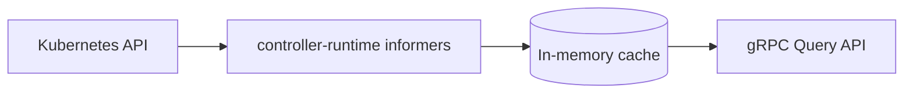

# Muninn

<p align="center">
  <picture>
    <source media="(prefers-color-scheme: dark)" srcset=".github/images/logo-dark.svg">
    <source media="(prefers-color-scheme: light)" srcset=".github/images/logo.svg">
    
  </picture>
</p>

<p align="center">
  <a href="https://github.com/Garoze/Muninn/actions/workflows/ci.yml"></a>
  <a href="./LICENSE"></a>
  <a href="./go.mod"></a>
</p>

**Kubernetes-native, multi-tenant runtime configuration discovery service.**

Muninn watches Kubernetes CRDs, projects them into an in-memory cache keyed
by tenant, and exposes that cache over a gRPC Query API. Downstream services
query Muninn for a set of keys scoped to a tenant instead of reading
Kubernetes objects directly — Muninn is the only component that needs to
know what a `Tenant`, `TenantConfig`, or `Policy` object looks like.



## Motivation

Most services in a multi-tenant platform need the same handful of
per-tenant facts — display name, feature flags, provisioned cloud resource
IDs, JWT validation rules — and none of them should read CRDs directly to
get them. Muninn centralizes that: one service watches the CRDs,
normalizes them into a stable key namespace, and serves that namespace over
gRPC with a documented contract (`Describe`) and hard whitelisting (unknown
keys are rejected, not silently ignored).

## Architecture

Three CRDs, all under group `muninn.io`, namespace `tenant-<id>`:

| CRD            | Scope      | Purpose                                                                              |
|----------------|------------|--------------------------------------------------------------------------------------|
| `Tenant`       | Cluster    | Identity, lifecycle phase, provisioned cloud resource refs (`status.cloudResources`) |
| `TenantConfig` | Namespaced | Arbitrary `map[string]string` runtime config                                         |
| `Policy`       | Namespaced | JWT validation settings, subject/role → permission bindings                          |

| Package                   | Role                                                              |
|---------------------------|--------------------------------------------------------------------|
| `internal/kube`           | controller-runtime informers, patch-based cache sync              |
| `internal/app`            | domain layer: `Cache`, `DiscoveryService.Query`, sentinel errors   |
| `internal/transport/grpc` | proto ↔ domain translation, gRPC handler                          |
| `internal/observability`  | Prometheus metrics, health checks, gRPC server/listener            |
| `internal/config`         | env-driven configuration                                            |
| `api/v1alpha1`            | CRD Go types + generated deepcopy                                  |
| `gen/discovery/v1`        | generated gRPC/protobuf stubs                                       |

The domain layer is decoupled from both Kubernetes and gRPC specifics —
each edge translates in its own direction, and the domain package itself
has no knowledge of either. See [`docs/design.md`](docs/design.md) for
why, and how that boundary is enforced.

Three design principles underpin the implementation:

- **Patch-based cache merge** — each CRD owns its own slice of a tenant's
  cached state, so a `Policy` update never touches `TenantConfig` data.
- **Readiness gating** — the gRPC health check stays `NOT_SERVING` until
  the informer cache completes its initial list+watch cycle.
- **Key whitelisting** — `Describe` exposes the full set of queryable
  keys; anything outside it returns `InvalidArgument` rather than an
  empty response.

See [`docs/design.md`](docs/design.md) for the rationale behind these and
other design decisions.

## Getting started

### Prerequisites

- Go 1.26+
- `make`
- A running Kubernetes cluster and `kubectl` pointed at it (developed
  against [k3s](https://k3s.io/); any cluster works)
- [`controller-gen`](https://github.com/kubernetes-sigs/controller-tools)
  on `PATH` (`go install sigs.k8s.io/controller-tools/cmd/controller-gen@latest`)
- [`grpcurl`](https://github.com/fullstorydev/grpcurl) (optional — for
  calling the API directly instead of through `muninnctl`; the server
  registers gRPC reflection, so no `.proto` files are needed client-side)
- [`setup-envtest`](https://pkg.go.dev/sigs.k8s.io/controller-runtime/tools/setup-envtest)
  (only for `make test-integration`) —
  `go install sigs.k8s.io/controller-runtime/tools/setup-envtest@latest`, then
  `export KUBEBUILDER_ASSETS=$(setup-envtest use -p path)`. Downloads a
  throwaway `etcd`/`kube-apiserver` pair; doesn't touch the real cluster.

### Install the CRDs

```bash
export KUBECONFIG=~/.kube/config   # or wherever the cluster's kubeconfig lives
make install-crds
```

Generates CRD manifests from the Go types in `api/v1alpha1` and applies
them.

### Apply the sample fixtures

```bash
make sample           # Namespace + Tenant + TenantConfig + Policy
make sample-status    # patches Tenant.status.cloudResources (a separate
                      # subresource — `kubectl apply` on spec alone can't
                      # touch it)
```

> [!NOTE]
> This creates a sample tenant (`arasaka`) with placeholder — not real —
> identity pool/storage bucket values, so there is data to query without
> further setup.

### Run it

> [!IMPORTANT]
> `KUBE_CONFIG_PATH` is Muninn's own config variable, separate from
> `kubectl`'s `$KUBECONFIG` — setting one does not set the other.

```bash
export KUBE_CONFIG_PATH=~/.kube/config
make run
```

or directly:

```bash
KUBE_CONFIG_PATH=~/.kube/config go run ./cmd/muninn
```

On success, structured logs report cache sync (`"informers synced and
watching"`) and the gRPC server binding `:5010` (configurable via
`GRPC_SERVICE_ADDR`).

### Query it

```bash
# discover the supported key namespace
make describe

# query specific keys for the sample tenant
make query TENANT=arasaka KEYS=TENANT.id,TENANT.displayName,TENANT.resources.identityPoolID
```

Or call the API directly with `grpcurl`, since the server registers gRPC
reflection:

```bash
grpcurl -plaintext localhost:5010 discovery.v1.DiscoveryService/Describe

grpcurl -plaintext -d '{
  "tenant_id": "arasaka",
  "keys": ["TENANT.id", "TENANT.displayName", "TENANT.resources.identityPoolID"]
}' localhost:5010 discovery.v1.DiscoveryService/Query
```

Live cluster changes are reflected without restarting the process — try
`kubectl patch tenantconfig arasaka -n tenant-arasaka --type=merge -p
'{"spec":{"runtimeConfig":{"NEW_KEY":"value"}}}'` and re-run the `Query`
call for `TENANT.runtime`.

## Deployment

`make run` runs Muninn on the host, against whatever `$KUBECONFIG` is
configured — suited to development, not production. `make deploy` runs it
as a Pod instead, under its own least-privilege `ServiceAccount`:

```bash
make image      # build the image
make load       # import it into k3s's containerd store
make deploy     # apply config/manager/ + config/rbac/
```

```bash
kubectl get pods -n muninn-system   # should reach 1/1 Running
kubectl port-forward -n muninn-system deploy/muninn 5010:5010 &
make query TENANT=arasaka KEYS=TENANT.id
```

`make undeploy` tears it back down. See [`docs/design.md`](docs/design.md)
for the RBAC and deployment rationale.

## Observability

Muninn exports an OpenTelemetry span for every gRPC call over OTLP to
`$OTEL_EXPORTER_OTLP_ENDPOINT` (default `localhost:4317`). Nothing needs to
be listening there for Muninn to run — spans fail to export silently if
the endpoint is unset or unreachable. To see them, run
[Jaeger](https://www.jaegertracing.io/)'s all-in-one image, which bundles
the collector, storage, and UI in one container:

```bash
podman run -d --name jaeger \
  -p 16686:16686 -p 4317:4317 \
  docker.io/jaegertracing/all-in-one:latest
# (or `docker run` in place of `podman run` — same image, same flags)
```

Then run Muninn pointed at it and issue a query:

> [!IMPORTANT]
> The default sample ratio is `0.1`, so a single manual query has only a
> 10% chance of being recorded. Set `OTEL_TRACES_SAMPLE_ARG=1` to sample
> every call for this walkthrough — otherwise Jaeger may show nothing.

```bash
export OTEL_EXPORTER_OTLP_ENDPOINT=localhost:4317
export OTEL_TRACES_SAMPLE_ARG=1
make run
```

```bash
make query TENANT=arasaka KEYS=TENANT.id
```

Open `http://localhost:16686`, select the `muninn` service, and find the
trace for that `Query` call.

## Testing

```bash
make test-unit             # go test ./... -short — no cluster required
make test-integration      # runs test/integration/envtest against a local,
                           # throwaway control plane (etcd + kube-apiserver) —
                           # not the real cluster. Requires KUBEBUILDER_ASSETS;
                           # see Prerequisites.

make test                  # both

make test-e2e              # deploys against the real cluster via `make
                           # deploy`, exercises it over gRPC, tears down via
                           # `make undeploy`. Requires the image already
                           # built and loaded (`make image load`). Not part
                           # of `make test` or CI — see docs/design.md.
```

Unit tests cover the domain layer, the gRPC translation boundary, the
Kubernetes watch-and-patch logic, observability wiring, and configuration
parsing — including negative-path and edge-case coverage alongside the
happy path, not only the resource-scoped merge guarantee described above.

## Makefile reference

| Target                                         | Does                                                                      |
|------------------------------------------------|---------------------------------------------------------------------------|
| `make generate`                                | Regenerate deepcopy code from kubebuilder markers                         |
| `make install-crds`                            | Generate + apply CRD manifests to `$KUBECONFIG`                           |
| `make sample` / `make sample-status`           | Apply sample fixtures / patch sample status                               |
| `make run`                                     | Run the server locally against `$KUBECONFIG`                              |
| `make test` / `test-unit` / `test-integration` | Run tests                                                                 |
| `make test-e2e`                                | Deploy + exercise + tear down against the real cluster (not part of `make test`) |
| `make query TENANT=<id> KEYS=<a,b,c>`          | Query keys for a tenant via `muninnctl`                                   |
| `make describe`                                | List supported configuration keys via `muninnctl`                         |
| `make fmt` / `vet` / `lint` / `tidy`           | Standard Go hygiene                                                       |
| `make proto`                                   | Regenerate gRPC stubs from `proto/v1/discovery.proto` (requires `protoc`) |
| `make build`                                   | Compile `cmd/` entrypoints into `bin/`                                    |
| `make image` / `load`                          | Build the container image / import it into k3s's containerd store        |
| `make deploy` / `undeploy`                     | Apply / tear down Muninn in-cluster under its own ServiceAccount          |

## Documentation

[`docs/design.md`](docs/design.md) covers the full rationale behind every
design decision referenced above: CRD field placement, the domain/transport
boundary, error translation, Fx wiring, in-cluster RBAC, the end-to-end
test, and OpenTelemetry tracing.

[`docs/adr/`](docs/adr/) records the decisions with the most significant
tradeoffs as standalone Architecture Decision Records.

## Status

Muninn is a portfolio project, not deployed in production. Its design
reflects patterns used in a production multi-tenant platform.
Feature-complete for its current scope:

- CRD watching, patch-based cache merge across `Tenant`/`TenantConfig`/`Policy`
- The full gRPC Query/Describe API
- `muninnctl` — a kubectl-style CLI for `query`/`describe`
- A container image (multi-stage, distroless, verified end-to-end into a local k3s node)
- In-cluster deployment under a least-privilege `ServiceAccount` (`config/manager/`, `config/rbac/`)
- Integration tests against a real API server via [`envtest`](https://pkg.go.dev/sigs.k8s.io/controller-runtime/pkg/envtest) (also wired into CI)
- An end-to-end deployment test against a real cluster (`test/e2e`, local-only — see `docs/design.md` for why it's not in CI)
- OpenTelemetry tracing on every gRPC call, `ParentBased` sampling, with a Jaeger walkthrough for viewing it (see `docs/design.md`)
- Fx-based dependency wiring and unit test coverage across every package

No further scope is currently planned.

## License

[MIT](./LICENSE)
