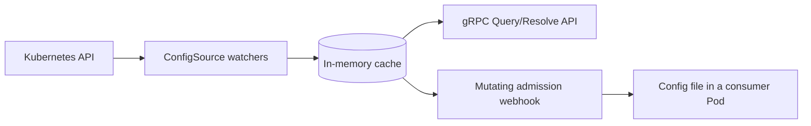

# Muninn

<p align="center">
  <picture>
    <source media="(prefers-color-scheme: dark)" srcset=".github/images/logo-dark.svg">
    <source media="(prefers-color-scheme: light)" srcset=".github/images/logo.svg">
    
  </picture>
</p>

<p align="center">
  <a href="https://github.com/Garoze/Muninn/actions/workflows/ci.yml"></a>
  <a href="./LICENSE"></a>
  <a href="./go.mod"></a>
</p>

**Kubernetes-native runtime configuration resolver.**

Muninn watches a pluggable set of Kubernetes objects (core `ConfigMap`,
scoped by a label selector, is the default and only source registered
today), projects them into an in-memory cache keyed by namespace, and
exposes that cache over a gRPC API (`Query` for specific keys, `Resolve`
for everything in a namespace, `Describe` for the active sources' shape).
A mutating admission webhook offers a second, code-free integration path:
a Pod that opts in via an annotation gets a shared volume, an init
container, and a sidecar injected automatically, and reads its resolved
configuration as a file instead of a gRPC client. Muninn makes no
assumptions about what those keys mean or what platform sits underneath
it. It resolves configuration, nothing more.



## Motivation

Most services in a Kubernetes-native platform need the same handful of
per-namespace configuration values, and none of them should read ConfigMaps
directly to get them: that couples every consumer to a naming convention
and a Kubernetes client. Muninn centralizes that: one service watches
labeled ConfigMaps, merges them into a per-namespace view, and serves that
view over gRPC with a documented contract (`Describe`).

A namespace is a natural, generic scope: it composes cleanly with a
single-namespace deployment (one ConfigMap in `default`), several
namespaces (a ConfigMap per namespace, as in the
[additional-namespaces example](#scoping-to-additional-namespaces-an-example)
below), or a consumer's own custom resource, without Muninn dictating which.

## Architecture

| Package                    | Role                                                                |
|----------------------------|----------------------------------------------------------------------|
| `internal/kube`            | `ConfigSource` interface + `ConfigMapSource`, informers, patch-based cache sync |
| `internal/app`             | domain layer: `Cache`, `DiscoveryService.Query/Resolve`, sentinel errors |
| `internal/transport/grpc`  | proto ↔ domain translation, gRPC handler, gRPC server/listener/TLS  |
| `internal/webhook`         | mutating admission webhook: Pod injection patch, secret-reference extraction, `SecretProviderClass` reconciliation, HTTPS server |
| `internal/discoveryclient` | shared gRPC dial helper (used by `muninnctl` and `muninn resolve`)    |
| `internal/observability`   | Prometheus metrics, tracing, health checks                          |
| `internal/config`          | env-driven configuration                                             |
| `gen/discovery/v1`         | generated gRPC/protobuf stubs                                        |

The domain layer is decoupled from both Kubernetes and gRPC specifics.
each edge translates in its own direction, and the domain package itself
has no knowledge of either. See [`docs/design.md`](docs/design.md) for
why, and how that boundary is enforced.

Four design principles underpin the implementation:

- **Pluggable sources**: the watch layer, cache, and domain layer are
  written against a `ConfigSource` interface, not against `ConfigMap`
  specifically. A bring-your-own custom resource registers a second
  source without changing any of the three.
- **Patch-based cache merge**: each source object owns its own slice of
  a namespace's cached state, so one source object's update never
  touches another's data in the same namespace.
- **Readiness gating**: the gRPC health check stays `NOT_SERVING`, and
  the webhook's `/readyz` returns 503, until every registered source's
  informer cache completes its initial list+watch cycle.
- **No admission-time dependency on the resolver**: the webhook runs its
  own watcher and cache and resolves in-process, so a resolver outage
  never blocks Pod scheduling.
- **No fixed key vocabulary**: Muninn serves whatever keys exist in the
  resolved source data; `Describe` reports the active sources' shape
  (kind, label selector, scope) rather than an enumerated key list, since
  the data itself is open-ended.

See [`docs/design.md`](docs/design.md) for the rationale behind these and
other design decisions.

## Getting started

### Prerequisites

- Go 1.26+
- `make`
- A running Kubernetes cluster and `kubectl` pointed at it (developed
  against [k3s](https://k3s.io/); any cluster works)
- [cert-manager](https://cert-manager.io/) already installed on the
  cluster (only for `make deploy-webhook`: the gRPC resolver alone,
  `make deploy`, doesn't need it). Muninn's own manifests issue a
  `Certificate` through it but don't install it themselves; see
  "Delivering config as a file" below.
- [`secrets-store-csi-driver`](https://secrets-store-csi-driver.sigs.k8s.io/)
  plus a supported provider (only [Vault](https://www.vaultproject.io/)
  is implemented) already installed on the cluster: only for consumers
  who want secrets delivered, not plain config. Muninn's webhook
  orchestrates the driver's own objects but doesn't install the driver
  or run a secret store itself; see "Delivering secrets" below.
- [`grpcurl`](https://github.com/fullstorydev/grpcurl) (optional: for
  calling the API directly instead of through `muninnctl`; the server
  registers gRPC reflection, so no `.proto` files are needed client-side)
- [`setup-envtest`](https://pkg.go.dev/sigs.k8s.io/controller-runtime/tools/setup-envtest)
  (only for `make test-integration`):
  `go install sigs.k8s.io/controller-runtime/tools/setup-envtest@latest`, then
  `export KUBEBUILDER_ASSETS=$(setup-envtest use -p path)`. Downloads a
  throwaway `etcd`/`kube-apiserver` pair; doesn't touch the real cluster.

### Apply the sample fixtures

```bash
export KUBECONFIG=~/.kube/config   # or wherever the cluster's kubeconfig lives
make sample                        # Namespace + a labeled ConfigMap
```

> [!NOTE]
> This creates a sample namespace (`arasaka`) with a ConfigMap labeled
> `muninn.io/config: "runtime"` and a couple of example `data` keys, so
> there is data to query without further setup. No CRD installation is
> required: Muninn watches core `ConfigMap` objects.

### Run it

> [!IMPORTANT]
> `KUBE_CONFIG_PATH` is Muninn's own config variable, separate from
> `kubectl`'s `$KUBECONFIG`. `make run`'s recipe forwards `$KUBECONFIG`
> into `KUBE_CONFIG_PATH` for you, so set `KUBECONFIG` (not
> `KUBE_CONFIG_PATH`) when using `make run`: only the direct `go run`
> invocation below needs `KUBE_CONFIG_PATH` set explicitly.

```bash
export KUBECONFIG=~/.kube/config
make run
```

or directly:

```bash
KUBE_CONFIG_PATH=~/.kube/config go run ./cmd/muninn serve
```

On success, structured logs report cache sync (`"informers synced and
watching"`) and the gRPC server binding `:5010` (configurable via
`GRPC_SERVICE_ADDR`).

### Restricting which sources run (optional)

`ENABLED_CONFIG_SOURCES` narrows the registered `ConfigSource`s down to a
named subset, by `Kind()`: unset (the default) runs everything
registered:

```bash
# only run the ConfigMap source (today's default, made explicit)
ENABLED_CONFIG_SOURCES=ConfigMap make run
```

`Describe` reflects the filter: it lists only sources that are both
registered in code and named here. Naming a kind that isn't registered
(a typo, for example) leaves nothing enabled and fails startup outright,
rather than running with no sources watched.

### Query it

```bash
# list the active config sources
make describe

# query specific keys for the sample namespace
make query NAMESPACE=arasaka KEYS=LOG_LEVEL,FEATURE_DARKMODE
```

Or call the API directly with `grpcurl`, since the server registers gRPC
reflection:

```bash
grpcurl -plaintext localhost:5010 discovery.v1.DiscoveryService/Describe

grpcurl -plaintext -d '{
  "namespace": "arasaka",
  "keys": ["LOG_LEVEL", "FEATURE_DARKMODE"]
}' localhost:5010 discovery.v1.DiscoveryService/Query
```

Live cluster changes are reflected without restarting the process: try
`kubectl patch configmap runtime-config -n arasaka --type=merge -p
'{"data":{"LOG_LEVEL":"debug"}}'` and re-run the `Query` call.

## Deployment

`make run` runs Muninn on the host, against whatever `$KUBECONFIG` is
configured: suited to development, not production. `make deploy` runs it
as a Pod instead, under its own least-privilege `ServiceAccount`:

```bash
make image      # build the image
make load       # import it into k3s's containerd store
make deploy     # apply config/manager/ + config/rbac/
```

```bash
kubectl get pods -n muninn-system   # should reach 1/1 Running
kubectl port-forward -n muninn-system deploy/muninn 5010:5010 &
make query NAMESPACE=arasaka KEYS=LOG_LEVEL
```

`make undeploy` tears it back down. See [`docs/design.md`](docs/design.md)
for the RBAC and deployment rationale.

### Scoping to additional namespaces (an example)

Muninn's core scope is a single label selector across namespaces, and it
imposes no namespace naming convention: any namespace with a matching
labeled ConfigMap works the same way as the sample fixture:

```bash
kubectl create namespace acme
kubectl apply -f - <<'EOF'
apiVersion: v1
kind: ConfigMap
metadata:
  name: runtime-config
  namespace: acme
  labels:
    muninn.io/config: "runtime"
data:
  FEATURE_DARKMODE: "false"
EOF

make query NAMESPACE=acme KEYS=FEATURE_DARKMODE
```

A second namespace (`globex`, or anything else) is the same ConfigMap
shape in a different namespace: Muninn's cache is keyed by namespace
regardless of what a given deployment chooses to call it.

### Delivering config as a file (the admission webhook)

`make deploy` alone covers the gRPC API. The mutating admission webhook is
a separate deployment, requiring [cert-manager](https://cert-manager.io/)
already installed on the cluster (an external prerequisite Muninn's own
manifests don't install):

```bash
make deploy-webhook     # apply config/webhook/: Issuer, Certificate,
                         # Service, Deployment, MutatingWebhookConfiguration
```

Annotate any Pod to opt in. Nothing else in its spec needs to change:

```yaml
metadata:
  annotations:
    muninn.io/inject: "true"
```

At admission, the webhook injects a shared volume, an init container that
resolves the Pod's namespace once, and a sidecar that keeps the file
current on an interval, and mounts that volume into the Pod's own
container too, so the application reads `/etc/muninn/config.yaml`
directly with no gRPC client of its own. `make undeploy-webhook` tears it
back down. See [`docs/design.md`](docs/design.md) for the injection and
drift-detection rationale.

### Delivering secrets

A secret is never written into a ConfigMap by value, only by
*reference*, using three keys sharing a common prefix:

```yaml
data:
  db_password_ref:  "vault://secret/data/arasaka/db-password"  # required: where it lives
  db_password_key:  "value"                                     # optional: which field within it
  db_password_file: "/mnt/secrets-store/db_password"             # for your own reference, see below
```

- **`*_ref`** is the only key Muninn acts on. At admission, the webhook
  scans resolved config for this suffix and generates (or, in
  `Reference` mode, validates) a `SecretProviderClass` describing what to
  fetch. There is one per namespace, shared by every Pod in it. The
  webhook never reads or caches the secret value itself.
- **`*_key`** picks a single field out of the secret at that path. Omit
  it and the mounted file contains the whole raw response as JSON
  instead. That is a safe default, not an error.
- **`*_file`** isn't interpreted by Muninn: it's documentation for
  yourself. The real mounted filename is always the `*_ref` key with
  `_ref` stripped (`db_password_ref` → `db_password`, always at the
  fixed path `/mnt/secrets-store/`), so this value only stays true if it
  matches that exactly.

A Pod picks this up the same way it picks up plain config: annotate it
`muninn.io/inject: "true"`, plus one thing plain config doesn't need:
its own `ServiceAccount` has to be able to authenticate to the secret
store (a Kubernetes-auth role bound to that `ServiceAccount`/namespace,
set up once, not per secret). From there, the application just reads a
file:

```bash
cat /etc/muninn/config.yaml        # plain config, as before
cat /mnt/secrets-store/db_password # the actual secret value
```

`SECRET_SPC_MODE` decides who owns the `SecretProviderClass`. `Create`
(the default) has the webhook generate and keep it current, so the
ConfigMap stays the only place you declare what a namespace needs; it
requires the write grant in
[`config/webhook/role_spc_writer.yaml`](config/webhook/role_spc_writer.yaml).
`Reference` expects a platform team to pre-provision the object and gives
the webhook read access only, rejecting admission when the object doesn't
describe the secrets your config references. That check compares the
secrets themselves, not the YAML text, so field order, quoting and
indentation are free to differ, but an entry your config never
references is rejected, since the driver would mount it anyway.

A reference added to an already-running
Pod's ConfigMap can't be mounted retroactively (the CSI mount is
immutable for the Pod's lifetime): the sidecar detects it, logs it, and
best-effort emits a `kubectl get events`-visible `Event`; picking it up
needs a Pod restart, an operator's call to make. That Event needs one
more RBAC grant most namespaces won't have by default:

```bash
make sample-events   # apply config/samples/event_writer_role*.yaml
```

See [ADR-0012](docs/adr/0012-csi-secret-delivery.md) for why secrets
flow this way: through the CSI driver directly, never through Muninn's
own process, with a trust-boundary diagram.

## Configuration

Every setting is an environment variable with a default, so both modes run
unconfigured against a local cluster. `serve` and `webhook` read the same
set; each ignores what it doesn't use.

**Resolver (`muninn serve`)**

| Variable | Default | Purpose |
|---|---|---|
| `KUBE_CONFIG_PATH` | *(unset)* | Path to a kubeconfig. Unset uses in-cluster credentials. |
| `CONFIGMAP_LABEL_SELECTOR` | `muninn.io/config=runtime` | Scopes which ConfigMaps are watched. |
| `ENABLED_CONFIG_SOURCES` | *(unset)* | Comma-separated `Kind` names. Unset enables every registered source; can only narrow. |
| `GRPC_SERVICE_ADDR` | `:5010` | gRPC API bind address. |
| `GRPC_PROBE_ADDR` | `:5011` | gRPC health probe bind address. |
| `GRPC_TLS_CERT_PATH` | *(unset)* | Enables TLS on the gRPC API. Must be set together with the key. |
| `GRPC_TLS_KEY_PATH` | *(unset)* | Private key paired with the above. Setting one alone is an error. |
| `CACHE_ENTRY_TTL` | `0` | Rejects entries older than this. `0` disables staleness checks. |
| `STARTUP_TIMEOUT` | `2m` | Budget for startup, including the initial informer sync. |

**Webhook (`muninn webhook`)**

| Variable | Default | Purpose |
|---|---|---|
| `MUNINN_INJECT_IMAGE` | *(required)* | Image stamped onto injected containers. Must match the webhook's own Deployment image; startup fails if unset. |
| `MUNINN_SELF_ADDR` | `muninn.muninn-system.svc.cluster.local:5010` | Address the injected containers dial. |
| `WEBHOOK_ADDR` | `:8443` | HTTPS bind address. |
| `WEBHOOK_TLS_CERT_PATH` | `/etc/webhook/certs/tls.crt` | Serving certificate, written by cert-manager. |
| `WEBHOOK_TLS_KEY_PATH` | `/etc/webhook/certs/tls.key` | Private key paired with the above. |
| `SECRET_SPC_MODE` | `Create` | `Create` generates the `SecretProviderClass`; `Reference` expects a pre-provisioned one and only validates it. Case-insensitive; an unrecognized value fails startup. |
| `VAULT_ADDRESS` | `http://vault.kube-system:8200` | Vault address written into the generated `SecretProviderClass`. |
| `VAULT_ROLE_NAME` | `muninn` | Vault Kubernetes-auth role bound to the CSI driver's ServiceAccount. |

**Both**

| Variable | Default | Purpose |
|---|---|---|
| `METRICS_ADDR` | `:9090` | Prometheus `/metrics` bind address. |
| `OTEL_EXPORTER_OTLP_ENDPOINT` | `localhost:4317` | OTLP trace endpoint (host:port, no scheme). |
| `OTEL_TRACES_SAMPLE_ARG` | `0.1` | Root-span sample ratio. A caller's own sampling decision is honored when present. |

> [!NOTE]
> TLS on the gRPC API is opt-in and off by default, on the assumption that
> a service mesh may already terminate it. The webhook's TLS is not
> optional: the Kubernetes API server calls admission webhooks over TLS
> unconditionally. See [`docs/design.md`](docs/design.md) for why the two
> are treated differently.

## Observability

Muninn exports an OpenTelemetry span for every gRPC call over OTLP to
`$OTEL_EXPORTER_OTLP_ENDPOINT` (default `localhost:4317`). Nothing needs to
be listening there for Muninn to run: spans fail to export silently if
the endpoint is unset or unreachable. To see them, run
[Jaeger](https://www.jaegertracing.io/)'s all-in-one image, which bundles
the collector, storage, and UI in one container:

```bash
podman run -d --name jaeger \
  -p 16686:16686 -p 4317:4317 \
  docker.io/jaegertracing/all-in-one:latest
# (or `docker run` in place of `podman run`: same image, same flags)
```

Then run Muninn pointed at it and issue a query:

> [!IMPORTANT]
> The default sample ratio is `0.1`, so a single manual query has only a
> 10% chance of being recorded. Set `OTEL_TRACES_SAMPLE_ARG=1` to sample
> every call for this walkthrough: otherwise Jaeger may show nothing.

```bash
export OTEL_EXPORTER_OTLP_ENDPOINT=localhost:4317
export OTEL_TRACES_SAMPLE_ARG=1
make run
```

```bash
make query NAMESPACE=arasaka KEYS=LOG_LEVEL
```

Open `http://localhost:16686`, select the `muninn` service, and find the
trace for that `Query` call.

## Testing

```bash
make test-unit             # go test ./... -short, no cluster required
make test-integration      # runs test/integration/envtest against a local,
                           # throwaway control plane (etcd + kube-apiserver),
                           # not the real cluster. Requires KUBEBUILDER_ASSETS;
                           # see Prerequisites.

make test                  # both
```

Unit tests cover the domain layer, the gRPC translation boundary, the
Kubernetes watch-and-patch logic, observability wiring, and configuration
parsing, including negative-path and edge-case coverage alongside the
happy path, not only the resource-scoped merge guarantee described above.
`make test` and the integration tier both run in CI.

### End-to-end tests

Two end-to-end tiers exist. Neither runs in CI, and that is deliberate:
both need a real cluster, and the CSI tier additionally needs `kind`,
`helm` and a container engine to provision one. Running them per commit
would trade several minutes of wall time for signal that changes only
when the deployment path itself changes. They are run on demand instead.

```bash
# Against a cluster you already have. Requires the image built and loaded
# first, since `make load` needs interactive sudo.
make image load
make test-e2e

# Provisions its own disposable kind cluster and tears it down after.
# Requires kind, helm, kubectl and podman or docker on PATH. Several
# minutes; installs secrets-store-csi-driver and Vault in dev mode.
make test-e2e-csi
```

`make test-e2e` deploys through the same `make deploy` / `make
deploy-webhook` targets a person would run by hand, exercises the gRPC
API over a port-forward, confirms an annotated Pod receives its config
file, and confirms a ConfigMap edit reaches that file without a restart.
`make test-e2e-csi` additionally confirms the webhook generates the
`SecretProviderClass` itself, that a real Vault secret and the config
file land in the same Pod, and that the sidecar reports a newly added
secret reference.

Two narrower claims are verified by hand rather than automated: that an
*unannotated* Pod schedules untouched, and that the webhook's
`failurePolicy: Fail` does not affect unrelated Pods. See
[`docs/design.md`](docs/design.md)'s Testing strategy for why.

## Makefile reference

| Target                                         | Does                                                                      |
|------------------------------------------------|---------------------------------------------------------------------------|
| `make sample`                                  | Apply the sample Namespace + labeled ConfigMap                            |
| `make sample-events`                           | Apply the sample RBAC for secret-drift `Event` visibility (see "Delivering secrets") |
| `make run`                                     | Run the server locally against `$KUBECONFIG`                              |
| `make test` / `test-unit` / `test-integration` | Run tests (both tiers run in CI)                                          |
| `make test-e2e`                                | Deploy + exercise + tear down against a cluster you already have (not in `make test` or CI) |
| `make test-e2e-csi`                            | Provisions its own disposable `kind` cluster and exercises the CSI secret-delivery path (not in `make test` or CI) |
| `make lint`                                    | `golangci-lint run ./...`, same check CI runs                            |
| `make query NAMESPACE=<ns> KEYS=<a,b,c>`       | Query keys for a namespace via `muninnctl`                                |
| `make describe`                                | List the active configuration sources via `muninnctl`                     |
| `make fmt` / `vet` / `lint` / `tidy`           | Standard Go hygiene                                                       |
| `make proto`                                   | Regenerate gRPC stubs from `proto/v1/discovery.proto` (requires `protoc`) |
| `make build`                                   | Compile `cmd/` entrypoints into `bin/`                                    |
| `make image` / `load`                          | Build the container image / import it into k3s's containerd store        |
| `make deploy` / `undeploy`                     | Apply / tear down Muninn in-cluster under its own ServiceAccount          |
| `make deploy-webhook` / `undeploy-webhook`     | Apply / tear down the mutating admission webhook                          |

## Documentation

[`docs/design.md`](docs/design.md) covers the full rationale behind every
design decision referenced above: the pluggable source model, the
domain/transport boundary, error translation, Fx wiring, in-cluster RBAC,
the end-to-end test, and observability.

[`docs/adr/`](docs/adr/) records the decisions with the most significant
tradeoffs as standalone Architecture Decision Records.

## Status

Muninn is a portfolio project, not deployed in production. Its design
reflects patterns used in a production platform, generalized into a
standalone config resolver with no platform assumptions baked in.
Feature-complete for its current scope:

- A pluggable `ConfigSource` interface; `ConfigMap` watching (label-selector scoped) is the registered default, patch-based cache merge across sources, with `ENABLED_CONFIG_SOURCES` to restrict which registered sources actually run
- The full gRPC `Query`/`Resolve`/`Describe` API
- `muninnctl`, a kubectl-style CLI for `query`/`describe`
- A mutating admission webhook (`muninn webhook`) that injects a shared volume, init container, and sidecar into Pods opted in via annotation, and mounts that volume into the Pod's own containers too: config delivered as a file, no gRPC client needed
- `muninn resolve`: the CLI mode backing the webhook's injected init container (one-shot) and sidecar (`--watch`, drift detection, atomic file writes)
- A container image (multi-stage, distroless, verified end-to-end into a local k3s node)
- In-cluster deployment under least-privilege `ServiceAccount`s for both the resolver (`config/manager/`, `config/rbac/`) and the webhook (`config/webhook/`, including cert-manager-issued TLS)
- Integration tests against a real API server via [`envtest`](https://pkg.go.dev/sigs.k8s.io/controller-runtime/pkg/envtest), covering ConfigMap projection, two sources of one kind resolving independently, the webhook resolving from its own cache with the resolver absent, and the exact RBAC verbs each `SECRET_SPC_MODE` needs: the full set runs in CI
- An end-to-end deployment test against a real cluster (`test/e2e`, local-only: see Testing above), covering annotated-Pod injection and drift-triggered file reload; unannotated-Pod behavior and `failurePolicy: Fail` blast radius are verified manually instead
- CSI-orchestrated secret delivery: the webhook derives a `SecretProviderClass` from `*_ref` keys in a namespace's resolved config and injects a CSI volume alongside the plain-config one, with the actual mount exercised end to end against a disposable `kind` cluster (`test/e2e`'s `TestCSIE2E`, also local-only): see `docs/adr/0012-csi-secret-delivery.md` and "Delivering secrets" above
- OpenTelemetry tracing and Prometheus metrics on every gRPC call and every webhook admission request, `ParentBased` sampling, with a Jaeger walkthrough for viewing traces (see `docs/design.md`)
- Fx-based dependency wiring and unit test coverage across every package

## License

[MIT](./LICENSE)
