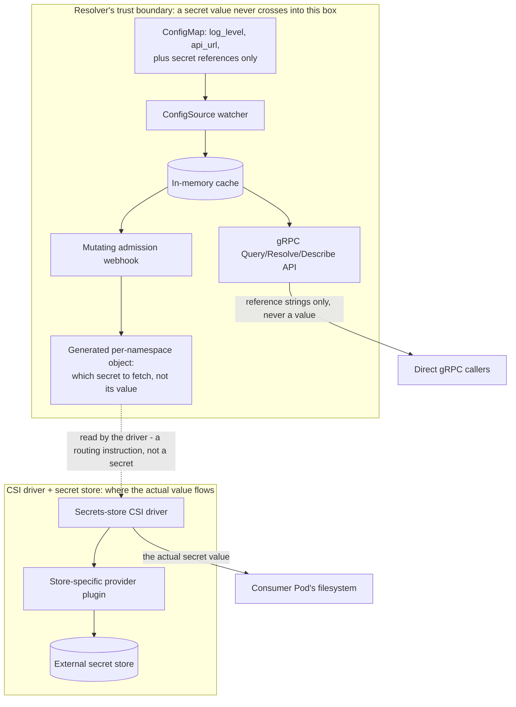

# ADR-0012: Secrets delivered via CSI, never through Muninn's own process

**Status:** Accepted

## Context

The resolver's data path is deliberately secret-free. The cache it serves
is built from ConfigMap-sourced data, and the query API performs no
caller authentication ([ADR-0003](0003-no-caller-auth-on-query-api.md))
on the premise that nothing flowing through it is a credential or grants
access to anything else. That premise is load-bearing: any object type
whose values reach the cache reaches every unauthenticated caller of the
API with it.

Consumers nonetheless need secrets alongside their configuration,
delivered with the same "no client code required" property the existing
file-delivery mechanism gives plain configuration. This record covers how
that is done without weakening the invariant the query API's access model
rests on.

## Decision

A secret is never represented in a ConfigMap by its value, only by a
reference: a key ending in a fixed suffix, whose value is a URI naming
where the real secret lives in an external store. At Pod admission, the
same webhook that builds the plain-config delivery path also scans
resolved configuration for these reference keys and derives a
per-namespace object describing which secrets a CSI secret-store driver
should fetch. That object names which secret to fetch and never carries a
fetched value. The driver and its store-specific provider plugin perform
the mount outside the resolver's process entirely: a secret value's only
path is from the external store, through the kubelet, to the consumer
Pod's filesystem.

## Alternatives considered

- **A general Secret-watching configuration source.** Rejected: any
  object type feeding real secret material into the resolver's cache
  reopens the invariant ADR-0003 depends on, regardless of how the
  watching mechanism is implemented or how narrowly RBAC scopes it. RBAC
  governs who may watch the objects; it says nothing about who may call
  the unauthenticated API those values would then be served through.
- **The resolver calling out to the external store and caching the
  result**, rather than only generating a reference for the CSI driver to
  act on. Rejected for the same reason as the point above: the mechanism
  differs, but a secret value would still transit and rest inside the
  resolver's own process, which is the property this design exists to
  avoid.
- **A second, purely illustrative pluggable source unrelated to
  secrets**, added only to demonstrate that the source interface
  generalizes beyond ConfigMaps. Rejected as a weaker use of the same
  effort: it demonstrates a property a reviewer already assumes the
  interface has, where orchestrating a CSI driver's lifecycle
  demonstrates a less commonly exercised part of the Kubernetes storage
  model.

## Consequences

The resolver's data path stays secret-free: every invariant ADR-0003
established continues to hold unchanged, even though secret delivery
exists as a capability. The tradeoff is an orchestration responsibility
the webhook takes on without taking on the underlying security
responsibility. It must derive a correct routing object from a
namespace's reference keys, but is never trusted with, and is not capable
of leaking, an actual secret value. That responsibility belongs entirely
to the CSI driver and the external store's own access controls.

The boundary does not establish authorization between namespaces. The
role the driver authenticates as is one process-level value shared by
every namespace, and the path it fetches is taken verbatim from the
namespace's own configuration. The store's policy for that single role is
therefore the whole of the isolation between one namespace's secrets and
another's; nothing in this system narrows it.

Two deployment postures follow from who owns the derived object's
lifecycle: the webhook can create and keep it in sync automatically, or a
platform team can pre-provision it and have the webhook validate against
it only. Each has a different RBAC footprint, documented separately from
this record.

One limitation follows from the mechanism rather than from a design
choice: a mount performed this way is immutable for the life of the Pod,
so a reference added to a ConfigMap after a Pod is running can be
observed and surfaced, but not applied retroactively. Picking it up
requires a Pod restart, which is an operator's decision rather than
something automated into an unannounced rewrite.

This repository implements exactly one store-specific provider plugin end
to end, with the reference URI's scheme documented as the extension point
for adding another. Broad multi-store support was never a goal;
demonstrating the orchestration pattern was.
