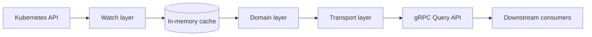

# Architecture

This document records why Muninn is built the way it is: the problem it
solves, the decisions made along the way, the alternatives weighed for
each, and the tradeoffs accepted. It is written to stay accurate across
implementation refactors — it describes responsibilities and contracts,
not files, functions, or package layout. The README covers what the
system does and how to run it; [`docs/adr/`](adr/) holds standalone
records for the decisions below with the most significant tradeoffs.

Muninn is a portfolio/reference implementation, not a production
deployment. Its design reflects patterns used in a real production
multi-tenant platform, but this codebase itself has not been deployed,
adopted, or operated in production.

---

## Problem being solved

In a multi-tenant platform, most services need the same small set of
per-tenant facts: display name, feature flags, provisioned cloud resource
identifiers, JWT validation rules. Without a shared discovery layer, each
service ends up independently reading the same Kubernetes objects,
duplicating parsing logic, and coupling itself to whatever shape those
objects happen to have today.

Muninn centralizes that: one service watches the relevant custom
resources, projects them into a stable, whitelisted key namespace, and
serves that namespace over a documented API. Consumers depend on a
contract, not on Kubernetes object internals.

## Goals and non-goals

**Goals:**
- Serve a stable, whitelisted set of per-tenant keys, decoupled from the
  underlying custom resources' actual field shape.
- Keep cached state correct under partial, out-of-order, and concurrent
  updates arriving independently across multiple resource types.
- Serve reads with low, predictable latency and no per-request dependency
  on the Kubernetes API server.
- Fail safely: never serve state for a tenant whose data hasn't finished
  loading, and never serve stale state for a tenant whose identity no
  longer exists.
- Demonstrate the engineering patterns behind this problem class
  (informer-based caching, API contract design, in-cluster RBAC,
  observability) in a form defensible on its own technical merits.

**Non-goals:**
- A general-purpose client library or configuration SDK. That pattern
  (layered config merge, pluggable loaders) already exists as proprietary
  code the author built against a real production system; duplicating it
  here would demonstrate the same skill twice rather than add new signal.
  If it's ever built as a portfolio artifact, it belongs in its own
  standalone, generic repository — not bolted onto a service that
  consumes it.
- A reconciler or control loop. Muninn never writes Kubernetes objects.
  It is a read-through cache, not a controller, and carries no
  reconciliation or write-path responsibility.
- A provisioning system. Muninn doesn't create the tenant identity,
  configuration, or policy objects it watches, or the cloud resources
  referenced by them — that's a separate system's job.
- Cross-cluster or multi-region federation.
- A production-hardened, operated service. This is a reference
  implementation built to be defensible in a technical discussion, not a
  system carrying production traffic, support commitments, or an SLA.

## High-level architecture

Four responsibilities, each isolated from the others:

- A **watch layer** that turns Kubernetes custom resource events into
  cache updates.
- A **domain layer** that owns the cache and the query logic against it,
  with no awareness of Kubernetes or any transport protocol.
- A **transport layer** that turns API requests into domain calls and
  domain results back into API responses.
- A cross-cutting **observability layer** (metrics, structured logs,
  traces) that instruments the above without participating in their
  logic.

A composition root assembles these at startup and owns their lifecycle
order — nothing else in the system needs to know how the others are
constructed.

**Decision:** Assemble components through a dependency-injection
framework, rather than constructing and wiring them by hand in the
composition root.

**Motivation:** Each layer's constructor and its lifecycle side effects
(start the watch loop, start the server) need to run in a specific
order, and that order is a direct consequence of which layer depends on
which. A framework that derives construction order from declared
dependencies keeps that ordering correct as layers are added or changed,
instead of relying on the composition root being edited correctly by
hand every time.

**Alternatives considered:**
- Hand-written wiring in the composition root, constructing each
  component in the right order directly — rejected: correct today, but
  the ordering constraint is implicit in the code rather than derived
  from declared dependencies, so a future change can silently violate it
  (construct something before what it depends on)
  without any error until runtime.

**Tradeoffs:** A dependency-injection framework adds a layer of
indirection between "what constructs what" and the code that reads it —
construction order is derived at startup rather than visible as a
straight-line sequence in the composition root. That's an accepted cost
for a system with enough independent components that manual ordering
would otherwise be a recurring source of startup-order bugs.

## Component responsibilities

| Responsibility | Owns | Never does |
|---|---|---|
| Watch layer | Translating custom resource events into cache updates | Answering queries, holding request state |
| Domain layer | Cached tenant state, query and whitelist logic, readiness state | Anything protocol-specific (Kubernetes or gRPC) |
| Transport layer | Request/response translation, error-to-status-code mapping | Business logic — it delegates every query to the domain layer |
| Observability layer | Metrics, structured logging, distributed tracing | Influencing request outcomes |

Three custom resources define the domain, each cluster-scoped or
namespace-scoped and each owning a distinct concern:

- **Tenant** (cluster-scoped) — identity, lifecycle phase, provisioned
  cloud resource references.
- **TenantConfig** (namespace-scoped) — arbitrary runtime configuration.
- **Policy** (namespace-scoped) — JWT validation settings and
  subject/role bindings.

## Kubernetes integration model

**Decision:** Watch custom resources via list-and-watch informers, never
poll, and never write back to the API server.

**Motivation:** The system needs near-real-time reflection of cluster
state without per-request API server load, and it has no reconciliation
responsibility that would require a write path.

**Alternatives considered:**
- Periodic polling of the API server — rejected: introduces a staleness
  window proportional to the poll interval, and scales polling load with
  both tenant count and poll frequency.
- A full reconciler pattern (compare desired vs. actual state, write
  corrections) — rejected: there is no "desired state" for Muninn to
  reconcile toward; it only needs to observe, never mutate.

**Tradeoffs:** Informers hold a full local copy of watched objects in
memory, trading memory footprint for read latency and reduced API server
load. This is the right tradeoff for a service that answers a very high
ratio of reads to underlying object changes.

RBAC follows from this model: every namespace-scoped resource lives in a
namespace created per tenant, so the set of namespaces this service must
watch grows and changes at runtime. A binding scoped to fixed, known
namespaces can't express that.

**Decision:** Grant access via a single cluster-scoped role bound
cluster-wide, rather than a namespace-scoped role bound per tenant
namespace.

**Alternatives considered:**
- A namespaced role per tenant namespace, created alongside each
  tenant — rejected: couples this service's access provisioning to
  tenant provisioning, and still can't grant access to a namespace before
  it exists.

**Tradeoffs:** A cluster-scoped grant is broader than any single tenant
needs, but it's the only binding shape that correctly expresses "watch
this resource type across an open-ended, growing set of namespaces."
The grant itself stays narrow in another dimension — read-only, and
excluding subresources this service never touches.

## Data flow

Two independent flows share the same cache, at different timescales:

1. **Write path (from Kubernetes):** a custom resource changes → the
   watch layer receives an event → the event is translated into a patch
   containing only the fields that resource type owns → the patch is
   merged into that tenant's existing cache entry.
2. **Read path (from a caller):** a query arrives with a tenant
   identifier and a set of keys → the domain layer resolves the tenant's
   current cache entry → requested keys are filtered against the
   whitelist → the result (or a precise error) is returned.

These two flows never block each other from correctness's point of view:
a query always reads whatever the cache currently holds, and a cache
update never needs to know a query is in flight.

**Decision:** Merge each incoming update into the tenant's existing cache
entry, touching only the fields the originating resource type owns,
rather than replacing the whole entry.

**Motivation:** The three resource types are updated independently and
asynchronously. A tenant's cached state has to reflect the union of the
latest data from all three, not only whichever one changed most
recently.

**Alternatives considered:**
- Replace the entire cached entry on every update — rejected: a change to
  one resource type would silently discard the other two resource types'
  contributions, since only one event's data is available at the moment
  of replacement.
- One shared, directly-mutated state object written by all watchers —
  rejected: couples every watcher to the full shape of tenant state,
  instead of only the portion it's responsible for.

**Tradeoffs:** Patch-based merge means no single event ever has a
complete picture of a tenant's state — reasoning about "what does this
tenant look like right now" always means reading the merged result, not
any one event. That's the right tradeoff for keeping the three watchers
fully decoupled from each other's data shape.

One deletion path is deliberately asymmetric with this pattern: when a
tenant's identity object is deleted, its entire cache entry is removed
outright, rather than merge-clearing only the identity portion.

**Motivation:** A tenant identity can legitimately not exist yet while
its configuration or policy data is still being provisioned — that's a
normal lifecycle state. The reverse is not normal: configuration or
policy data outliving the identity it belongs to is an orphan, because
there's no ownership cascade wired between these independently-owned
resources. Once identity is gone, continuing to answer queries assembled
from orphaned data would answer for a tenant that, identity-wise, no
longer exists — a worse outcome than a clear "not found."

**Alternatives considered:**
- Wire an ownership cascade so deleting the identity object cascades to
  the others automatically — rejected: creating and owning these objects
  is a separate system's responsibility; a read-only watcher has no
  standing to set up cascade behavior between resources it doesn't
  create.

**Decision:** Hold reads in a `NOT_SERVING` state until the initial watch
cycle across all three resource types completes, rather than serving
immediately on startup.

**Motivation:** A freshly started replica with an empty cache can't
distinguish "this tenant doesn't exist" from "this tenant exists but
hasn't been loaded yet." Serving immediately would return a false
negative for the second case.

**Alternatives considered:**
- Serve immediately and treat empty results as valid — rejected: produces
  incorrect "not found" answers during every cold start.
- An external poll of cache state to gate traffic — rejected: adds
  latency and a second, redundant source of truth for readiness.

**Tradeoffs:** Every replica has a startup window where it can't serve
traffic. This is bounded by how long the initial watch cycle takes, and
it's the correct cost for guaranteeing no false negatives — the same
signal is also surfaced to Kubernetes itself (see Observability
considerations), so replicas in this state are held out of traffic
automatically rather than by an internal check alone.

## API boundaries

**Decision:** The domain layer's public surface uses only primitives and
its own types — no protocol-specific status codes or generated wire
types appear in it, and this boundary is enforced structurally (the
domain layer has no dependency capable of expressing those types), not
by convention alone.

**Motivation:** Whatever transport this service exposes should be
swappable without touching business logic, and the domain layer should
be testable without standing up any transport machinery.

**Alternatives considered:**
- Allow the domain layer to depend on the transport layer's error types
  directly, translating only at the very edge of the process — rejected:
  makes the domain layer's correctness depend on a transport-specific
  concept (status codes) it has no reason to know about.

**Tradeoffs:** Every domain-level failure needs a translation step at the
transport boundary. That's a small, fixed cost in exchange for a domain
layer that can be tested, and potentially reused behind a different
protocol, without modification.

**Decision:** The transport layer depends on a concrete domain service,
not an interface it defines for itself, despite the common convention
that a consumer should depend on an interface it owns.

**Motivation:** Interfaces earn their cost when the concrete
implementation is expensive or non-deterministic to construct (a
database, a network call). The domain layer here is an in-memory
lookup with no I/O — substituting a fake behind an interface would
reimplement the same logic under test, not remove a real dependency.

**Alternatives considered:**
- A transport-defined interface, satisfied by the concrete domain
  service — rejected: no second implementation exists or is anticipated,
  and the interface would add a layer of indirection without a
  corresponding testing or flexibility benefit.

**Tradeoffs:** If a second concrete implementation of the domain service
ever appears (for example, a caching decorator in front of it), this
decision gets revisited then — introducing the interface at that point
costs nothing, since the language's interfaces are satisfied implicitly.

**Decision:** Expose the API over gRPC, with a query operation and a
schema-discovery operation, rather than a REST/JSON interface.

**Motivation:** Consumers are other backend services within the same
cluster, not browsers or third-party API clients. A typed, contract-first
RPC interface with generated clients fits that consumer population
better than a hand-maintained REST surface, and the discovery operation
gives clients a way to learn the supported key namespace without a
separate document to keep in sync.

**Alternatives considered:**
- A REST/JSON API — rejected: would need a separate schema-discovery
  mechanism built by hand (gRPC reflection and a `Describe`-style RPC
  give this for free), and offers no benefit over gRPC for an
  internal, service-to-service contract.

**Tradeoffs:** gRPC is a heavier client dependency than plain HTTP for
any consumer outside the cluster's own service mesh — an acceptable cost
given the API's actual consumer population.

**Decision:** Requests resolve their tenant fresh from cache on every
call, rather than a client pinning a tenant context once at connection
setup.

**Motivation:** A tenant's cached state can change between two calls on
the same long-lived connection. Resolving per request means callers
always see current state without reconnecting or invalidating anything
client-side.

**Alternatives considered:**
- Bind a tenant context to the connection once — rejected: introduces
  stale state for the lifetime of the connection, which is exactly the
  failure mode this system exists to prevent for its own consumers.

**Decision:** Keys not in an explicit, documented whitelist are rejected
with a precise error, rather than silently omitted or passed through.

**Motivation:** Without a whitelist, the API's effective contract is
"whatever fields the underlying resources happen to have" — anything a
consumer can currently read becomes something they can depend on,
whether or not that was intended.

**Alternatives considered:**
- Expose whatever fields exist on the underlying resources directly (by
  reflection or pass-through) — rejected: couples the API contract to
  internal resource shape, breaking consumers on any schema change to
  those resources.

**Tradeoffs:** Every field added to the underlying resources needs an
explicit whitelist update before it's queryable — a deliberate hurdle
that keeps the contract stable at the cost of one extra step per new
field.

Errors cross this boundary through a fixed, small set of categories —
not-found, invalid input, temporarily unavailable, and an internal
catch-all — mapped from domain-level failure identity, not from string
or type matching, since domain errors carry additional context by the
time they reach this boundary and an equality check on the wrapped error
would silently misclassify them.

## Configuration lifecycle

Two different things share the word "configuration" here, with different
lifecycles:

**The service's own configuration** — how this process itself is
configured (where the Kubernetes credentials live, which address to bind,
where to export telemetry) — is read once from the environment at
startup and never changes for the life of the process. A replica that
needs different configuration is restarted, not reconfigured in place.

**Decision:** Configure the process via environment variables with
built-in defaults, rather than a configuration file or command-line
flags.

**Motivation:** Environment variables are the natural configuration
surface for a container running under Kubernetes — they're set directly
in the pod spec, need no file to mount, and every value has a sensible
default so the service runs unconfigured in a local, single-cluster
context.

**Alternatives considered:**
- A structured configuration file — rejected: adds a file to generate,
  mount, and keep in sync with the Deployment manifest, for a
  configuration surface small enough that a flat set of env vars is
  already unambiguous.
- Command-line flags — rejected: less idiomatic for container
  configuration than environment variables, and harder to override per
  environment without templating the container's command.

**Tenant-owned runtime configuration** — the actual data this service
exists to serve — has a completely different lifecycle: it's owned and
changed by whatever provisions and edits the underlying custom resources,
continuously observed rather than loaded once, and reflected into the
cache within the watch layer's event latency. It has no expiry or
version history inside this service — the cache always reflects the
latest observed state, nothing more.

## Multi-tenancy model

Tenants are isolated by two mechanisms working together: a cluster-scoped
identity object anchors each tenant's existence, while the
tenant-specific configuration and policy data live in a namespace created
per tenant. The cache itself is keyed by tenant identifier, so no
cross-tenant data ever shares a single cache entry.

**Decision:** Isolate tenant-owned resources by namespace, one namespace
per tenant, rather than colocating all tenants' resources in shared
namespaces distinguished by labels.

**Motivation:** Namespace boundaries compose directly with Kubernetes'
own RBAC and network policy primitives — anything that needs to scope
access or traffic to a single tenant's resources can do so at the
namespace level without additional selector logic.

**Alternatives considered:**
- A shared namespace with tenant-identifying labels — rejected: every
  consumer of these resources (including this service, and anything
  enforcing RBAC or network policy) would need label-selector filtering
  to get tenant isolation that a namespace boundary provides for free.

**Tradeoffs:** Namespace-per-tenant means the set of namespaces this
service must watch is open-ended and grows with tenant count, which is
what drives the cluster-scoped RBAC decision above — a direct
consequence, not an independent choice.

**Decision:** Model tenant identity, configuration, and policy as three
separate custom resources, rather than one combined resource.

**Motivation:** These three concerns have different owners and different
change cadences in practice — identity and provisioned resource
references change when infrastructure is provisioned, configuration
changes when operators adjust runtime behavior, and policy changes when
security rules are updated. Separate resources let each be written by
whichever actor owns that concern, without needing to coordinate writes
to a shared object.

**Alternatives considered:**
- A single combined resource covering all three concerns — rejected:
  would need either a single writer for all three concerns, or a
  merge/subresource strategy to let different actors safely write
  different parts of one object — machinery Kubernetes already provides
  for free across three separate resources.

**Tradeoffs:** Three resources means three independent watches and the
patch-merge logic described above to keep a tenant's cached view
coherent across all three, instead of one watch with no merge step. That
complexity buys independent ownership and independent write access per
concern.

The API's own security model rides on this same separation: policy data
(JWT validation rules, subject and role bindings) describes how
*downstream consumers* should validate and authorize the traffic they
themselves receive — this service serves that data, but does not itself
authenticate or authorize its own callers against it (see Security
considerations).

## Security considerations

Access to the Kubernetes API is scoped as narrowly as the integration
model allows: read-only (list/watch, never write) on exactly the three
custom resource types this service needs, with no access to any
subresource this service never reads or writes.

The runtime environment is hardened independently of any single
mechanism — the process runs as a non-root user with a read-only root
filesystem, no privilege escalation, and no Linux capabilities, layered
on top of (not merely inherited from) a minimal, non-root base container
image. Neither layer relies on the other alone being correct.

**Decision:** The gRPC API itself performs no caller authentication or
authorization.

**Motivation:** This service's job is projecting policy *data* for
downstream consumers to enforce against their own end users — it is not
itself an authorization gateway, and adding one would be a second,
unrelated surface area alongside the caching and Kubernetes-integration
patterns this project exists to demonstrate.

**Alternatives considered:**
- A gRPC authentication interceptor validating caller identity —
  rejected for this scope: worth doing in a real deployment, but it's an
  orthogonal concern from tenant data projection, and a real deployment
  would more naturally enforce this at a service mesh or network-policy
  layer than reimplement it inside this service.

**Tradeoffs:** As built, network-level access to this service's API is
the only access control in effect. A real deployment of this pattern
would need to sit behind cluster-internal network policy, a service
mesh's mutual TLS, or an API gateway — this is stated as an explicit
limitation of the reference implementation, not an oversight.

No credentials pass through this service in either direction — the cloud
resource references it serves are identifiers (pool IDs, ARNs, bucket
names), not credentials themselves, and its own Kubernetes access uses no
long-lived static credentials beyond whatever the cluster's own
service-account token mechanism provides.

## Observability considerations

Every request produces a distributed trace span, structured log entries,
and metric observations — three complementary views of the same event,
each suited to a different question (a trace answers "what happened in
this one request," logs answer "what happened around this specific
event," metrics answer "what does behavior look like in aggregate").

**Decision:** Trace sampling honors a caller's own sampling decision when
one is already present on an incoming request, rather than applying this
service's own sampling ratio unconditionally to every span.

**Motivation:** This service is called by other services, not only by
end users directly. If an upstream caller already decided a request is
worth tracing end-to-end, re-rolling that decision independently here
would silently drop this service's span from a trace someone else
already chose to capture.

**Alternatives considered:**
- A flat sampling ratio applied to every span regardless of inbound
  context — rejected: breaks end-to-end traces whenever this service's
  independently-rolled decision disagreed with an upstream caller's.

**Decision:** Metric labels carry only bounded, low-cardinality
dimensions (operation name, outcome) — tenant identifier is deliberately
excluded from metric labels.

**Motivation:** Tenant identifiers are operator-controlled and
effectively unbounded in number. A label dimension with unbounded
cardinality turns a fixed-size metrics surface into one that grows
without limit as tenants are added, which is a correctness and
resource-usage risk, not merely a style preference.

**Alternatives considered:**
- Include tenant identifier as a metric label for per-tenant
  dashboards — rejected: the cardinality risk outweighs the benefit;
  per-tenant detail belongs in traces and logs, which are built for
  high-cardinality dimensions, not in metrics.

**Tradeoffs:** Per-tenant behavior isn't directly visible in aggregate
metrics — answering "how is this specific tenant doing" requires looking
at traces or logs instead. That's an acceptable division of
responsibility across the three observability signals.

The same readiness signal that gates traffic (see Data flow) is also
what an external health check observes — a replica whose cache hasn't
finished its initial sync is excluded from traffic by the platform
itself, not only by an internal check nothing outside the process can
see.

Outbound calls this service makes to the Kubernetes API are not
themselves traced. Extending tracing to cover them is a real, bounded
extension — deliberately out of scope for now rather than an oversight.

## Testing strategy

Three tiers, each validating a different layer of the integration model:

**Decision:** Validate Kubernetes integration against a real API server
and control plane, not a fake or mocked client.

**Motivation:** This service's correctness depends on real API server
behavior — defaulting, validation, and watch semantics — that a fake
client doesn't reproduce faithfully. A bug that only manifests against
real API server behavior would pass against a fake and fail in any real
cluster.

**Alternatives considered:**
- A fake or mocked Kubernetes client — rejected for integration-level
  tests: faster and simpler, but validates against an approximation of
  API server behavior rather than the behavior itself.

**Tradeoffs:** Tests against a real control plane are slower and need an
external toolchain to provision a throwaway API server and datastore.
That cost buys confidence that watch and merge behavior is correct
against real Kubernetes semantics, not merely against a simplified
stand-in for them.

**Decision:** A separate, real-cluster end-to-end test exercises the
actual deployment tooling a person would run by hand, rather than
provisioning resources through a Kubernetes client library the way
lower-level tests do.

**Motivation:** Watch correctness (validated above) and deployment
correctness (RBAC scope, container image, readiness wiring all working
together against a real cluster) are different claims. Only exercising
the actual deploy path, end to end, validates the second one.

**Alternatives considered:**
- Provision the same resources via a Kubernetes client library, as the
  lower-level integration tests do — rejected for this tier
  specifically: would validate that the resources *can* be created, not
  that the actual, human-facing deployment path produces a working
  system.

**Tradeoffs:** This tier requires a real cluster and a pre-built,
pre-loaded container image, and is consequently run on demand rather
than on every change — a deliberate cost/signal tradeoff for a check
that's expensive to run continuously and whose signal a live manual
verification already covers for a reference implementation at this
scale.

Below both of these, the domain layer's query and whitelist logic, and
the transport layer's request/response translation, are validated in
isolation and without any external dependency — cheap, fast checks for
the large majority of this system's logic that has nothing to do with
Kubernetes or the network at all.

---

## Decisions not taken

Some paths were deliberately not built, and are recorded here for the
same reason any other decision is: so the reasoning survives even if the
question comes up again later.

**Decision:** No client library or configuration-loading SDK ships
alongside this service.

**Motivation:** This exact problem — merging layered configuration from
multiple sources through a pluggable loader — has already been solved by
the author as proprietary code against a real production system.
Reimplementing that pattern here would demonstrate the same skill a
second time rather than add new signal to this project specifically.

**Alternatives considered:**
- Ship a thin client library alongside this service — rejected for this
  repository's scope: the interesting engineering problem it would
  demonstrate is already demonstrated elsewhere; bolting a copy onto a
  service that consumes it would blur two distinct portfolio artifacts
  into one.

**Tradeoffs:** Anyone using this service today writes their own gRPC
client call rather than importing a purpose-built one. If this pattern
is ever built as a standalone artifact, it belongs in its own generic,
non-Kubernetes-specific repository — not as a package inside this one.
