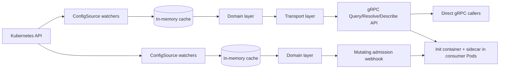

# Architecture

This document records why Muninn is built the way it is: the problem it
solves, the decisions made along the way, the alternatives weighed for
each, and the tradeoffs accepted. It is written to stay accurate across
implementation refactors: it describes responsibilities and contracts,
not files, functions, or package layout. The README covers what the
system does and how to run it; [`docs/adr/`](adr/) holds standalone
records for the decisions below with the most significant tradeoffs.

Muninn is a portfolio/reference implementation, not a production
deployment. Its design reflects patterns used in a real production
platform, but this codebase itself has not been deployed, adopted, or
operated in production.

---

## Problem being solved

Workloads running in Kubernetes routinely need small amounts of runtime
configuration such as feature flags, log levels and per-environment
settings, which changes independently of the container image and needs
to reach a running Pod without a restart. The data usually already exists as a
Kubernetes object (a ConfigMap, or a custom resource an operator
maintains); the missing piece is a way to serve it to consumers that
scales past "one workload reads its own ConfigMap directly."

Muninn is a runtime configuration resolver: it watches a pluggable set of
Kubernetes objects, keeps an in-memory, always-current projection of
their data, and exposes that projection over a gRPC API and (optionally)
as a file delivered directly into a consumer's Pod. It makes no
assumptions about what platform, identity model, or infrastructure a
consumer runs downstream: it resolves whatever the objects it watches
contain, for whichever scope (namespace, by default) a caller asks
about.

## Goals and non-goals

**Goals:**
- Resolve configuration from a pluggable set of Kubernetes object types,
  not a fixed schema this service defines.
- Keep cached state correct under partial, out-of-order, and concurrent
  updates arriving independently across multiple objects in the same
  scope.
- Serve reads with low, predictable latency and no per-request
  dependency on the Kubernetes API server.
- Fail safely: never serve a scope's data before its cache has finished
  an initial load, and never silently serve state a source object no
  longer backs.
- Offer a file-based integration path (a mutating admission webhook) for
  consumers that would rather read a file than embed a gRPC client.
- Demonstrate the engineering patterns behind this problem class
  (informer-based caching, pluggable source abstractions, admission
  control, observability) in a form defensible on its own technical
  merits.

**Non-goals:**
- A general-purpose client library or configuration SDK. Merging layered
  configuration through a pluggable loader on the consuming side is a
  distinct engineering problem from the source-watching and caching this
  service demonstrates. Bundling both into one repository would blur
  two separable concerns instead of sharpening either. If it's ever
  built, it belongs in its own standalone, generic repository: not
  bolted onto the service it would consume.
- A reconciler or control loop. The only cluster state Muninn writes is
  request-scoped: the Pod-spec patch its admission webhook returns, and
  the per-namespace secret-routing object that webhook derives from the
  configuration it resolved (see Secret delivery below). Neither is a
  steady-state write responsibility, and nothing is reconciled toward a
  desired state on an ongoing basis.
- A provisioning system. Muninn doesn't create the ConfigMaps or custom
  resources it watches: that's whatever operator or control plane
  manages the consuming workload's own deployment.
- An enforced multi-tenancy model. Namespace-scoped isolation is a usage
  pattern this service composes with, not something it models, validates,
  or enforces itself (see Multi-tenancy is a usage pattern, not an
  architecture).
- Cross-cluster or multi-region federation.
- A production-hardened, operated service. This is a reference
  implementation built to be defensible in a technical discussion, not a
  system carrying production traffic, support commitments, or an SLA.

## High-level architecture

The two processes each assemble the same watch, cache and domain
components from the same source; neither reads the other's. The injected
containers do call the gRPC API, but only after admission has already
completed.

Five responsibilities, each isolated from the others:

- A **watch layer** that turns Kubernetes object events, across a
  pluggable set of source kinds, into cache updates.
- A **domain layer** that owns the cache and the resolution logic against
  it, with no awareness of Kubernetes or any transport protocol.
- A **transport layer** that turns gRPC requests into domain calls and
  domain results back into gRPC responses, and stands up the gRPC server
  those requests arrive on (listener binding, optional TLS).
- A **delivery layer** (the mutating admission webhook) that, for
  opted-in Pods, injects a shared volume plus an init container and
  sidecar that call the gRPC API on the Pod's behalf and write the result
  to a file, an alternative to embedding a gRPC client at all. The
  webhook runs its own watch layer and its own instance of the domain
  layer, so deciding an admission depends on nothing outside its own
  process and the Kubernetes API (see Availability boundaries below).
- A cross-cutting **observability layer** (metrics, structured logs,
  traces) that instruments the gRPC API and the webhook without
  participating in either's logic.

A composition root assembles these at startup and owns their lifecycle
order: nothing else in the system needs to know how the others are
constructed. The gRPC resolver and the webhook run as separate processes
(see [ADR-0010](adr/0010-single-process-webhook.md)); each assembles only
the components its own mode needs.

**Decision:** Assemble components through a dependency-injection
framework, rather than constructing and wiring them by hand in the
composition root.

**Motivation:** Each layer's constructor and its lifecycle side effects
(start the watch loop, start the server) need to run in a specific
order, and that order is a direct consequence of which layer depends on
which. A framework that derives construction order from declared
dependencies keeps that ordering correct as layers are added or changed,
instead of relying on the composition root being edited correctly by
hand every time.

**Alternatives considered:**
- Hand-written wiring in the composition root, constructing each
  component in the right order directly. Rejected: correct today, but
  the ordering constraint is implicit in the code rather than derived
  from declared dependencies, so a future change can silently violate it
  (construct something before what it depends on)
  without any error until runtime.

**Tradeoffs:** A dependency-injection framework adds a layer of
indirection between "what constructs what" and the code that reads it:
construction order is derived at startup rather than visible as a
straight-line sequence in the composition root. That's an accepted cost
for a system with enough independent components that manual ordering
would otherwise be a recurring source of startup-order bugs. It also
means a wiring mistake (a dependency the graph cannot satisfy) fails at
process start rather than at compile time, and is invisible to unit
tests, which construct components directly rather than through the
graph. Tests that assemble the real modules exist for that reason.

## Component responsibilities

| Responsibility | Owns | Never does |
|---|---|---|
| Watch layer | Translating source-object events into cache updates, across a pluggable set of source kinds | Answering queries, holding request state |
| Domain layer | Cached scope state, resolution logic, readiness state | Anything protocol-specific (Kubernetes or gRPC) |
| Transport layer | Request/response translation, error-to-status-code mapping, standing up the gRPC server (listener, optional TLS) those requests arrive on | Business logic, it delegates every query to the domain layer |
| Delivery layer (webhook) | Deciding whether a Pod opted in, resolving the Pod's scope from its own cache, building the injection patch, deriving the secret-routing object | Reading or handling a secret value; depending on the gRPC resolver process being reachable |
| Observability layer | Metrics, structured logging, distributed tracing | Influencing request outcomes |

A pluggable source abstraction defines what the watch layer needs from
any source kind: what to watch, how to scope it (a label selector, a
namespace or cluster scope), and how to extract the fields it
contributes to a cache entry. One implementation is registered today: a
source watching core `ConfigMap` objects, scoped by a configurable label
selector, but nothing in the watch layer, the cache, or the domain layer
is written against `ConfigMap` specifically. A second source kind (a
bring-your-own custom resource, for example) registers by satisfying the
same abstraction; nothing downstream changes.

## Kubernetes integration model

**Decision:** Watch source objects via list-and-watch informers, never
poll, and never write back to the API server (outside the admission
webhook's own patch response, which is a request-scoped mutation, not a
steady-state write).

**Motivation:** The system needs near-real-time reflection of cluster
state without per-request API server load, and it has no reconciliation
responsibility that would require a write path.

**Alternatives considered:**
- Periodic polling of the API server. Rejected: introduces a staleness
  window proportional to the poll interval, and scales polling load with
  both scope count and poll frequency.
- A full reconciler pattern (compare desired vs. actual state, write
  corrections). Rejected: there is no "desired state" for Muninn to
  reconcile toward; it only needs to observe, never mutate cluster state.

**Tradeoffs:** Informers hold a full local copy of watched objects in
memory, trading memory footprint for read latency and reduced API server
load. This is the right tradeoff for a service that answers a very high
ratio of reads to underlying object changes.

RBAC follows from this model: the label-selector-scoped source watches
`ConfigMap` objects across every namespace matching that selector: an
open-ended set that changes at runtime as namespaces and ConfigMaps come
and go. A binding scoped to fixed, known namespaces can't express that.

**Decision:** Grant access via a single cluster-scoped role bound
cluster-wide, rather than a namespace-scoped role bound per namespace.

**Alternatives considered:**
- A namespaced role per namespace, created and torn down as namespaces
  appear and disappear. Rejected: couples this service's access
  provisioning to whatever creates those namespaces, and still can't
  grant access to a namespace before it exists.

**Tradeoffs:** A cluster-scoped grant is broader than any single
namespace needs, but it's the only binding shape that correctly
expresses "watch this resource type across an open-ended, changing set of
namespaces." The grant stays narrow in another dimension: scoped to
exactly the resource type (core `ConfigMap`) the registered source
watches, with no subresources. A bring-your-own source kind brings its
own RBAC requirement, which is that source's registration
responsibility, not something this service's own manifests grant
implicitly.

The two processes carry different grants, under separate service
accounts. The resolver's is read-only. The webhook's adds the write
verbs its secret-routing object needs, and those verbs live in a
separate, separately-bound role so a deployment that pre-provisions that
object instead can decline them entirely (see Secret delivery below).
Neither process holds the other's permissions.

## Data flow

Two independent flows share the same cache, at different timescales:

1. **Write path (from Kubernetes):** a watched object changes → the
   watch layer receives an event → the event is translated into a patch
   containing only the fields that source object owns → the patch is
   merged into that scope's existing cache entry.
2. **Read path (from a caller):** a request arrives naming a scope
   (namespace, by default) → the domain layer resolves that scope's
   current cache entry → either specific requested keys are resolved
   against it (`Query`) or the entire merged result is returned
   (`Resolve`) → the result (or a precise error) is returned.

These two flows never block each other from correctness's point of view:
a query always reads whatever the cache currently holds, and a cache
update never needs to know a query is in flight.

**Decision:** Merge each incoming update into the scope's existing cache
entry, touching only the fields the originating source object owns,
rather than replacing the whole entry.

**Motivation:** Multiple source objects can exist in the same scope,
updated independently and asynchronously. A scope's cached state has to
reflect the union of the latest data from all of them, not only whichever
one changed most recently.

**Alternatives considered:**
- Replace the entire cached entry on every update. Rejected: a change
  to one source object would silently discard every other source
  object's contribution to that scope, since only one event's data is
  available at the moment of replacement.
- One shared, directly-mutated state object written by every watcher.
  Rejected: couples every watcher to the full shape of scope state,
  instead of only the portion it's responsible for.

**Tradeoffs:** Patch-based merge means no single event ever has a
complete picture of a scope's state: reasoning about "what does this
scope look like right now" always means reading the merged result, not
any one event. That's the right tradeoff for keeping every source object
fully decoupled from every other source object's data shape. Each
source's contribution is keyed by a cache-facing identity distinct from
its externally-reported type, so two sources sharing an object name in
the same scope don't collide, including two independently registered
sources of the same type, which a type-only key can't distinguish from
each other. That identity defaults to the type itself when only one
source of that type is registered, which is every source registered
today; registering a second source of the same type without giving each
a distinct identity is rejected outright at startup rather than allowed
to silently collide at runtime.

A scope's cache entry disappears entirely once every source object
backing it is gone: there's no special-cased "identity" source whose
deletion behaves differently from any other. Every source object is a
peer contributor to the same entry.

**Decision:** Hold reads in a `NOT_SERVING` state until the initial watch
cycle across every registered source completes, rather than serving
immediately on startup.

**Motivation:** A freshly started replica with an empty cache can't
distinguish "this scope doesn't exist" from "this scope exists but hasn't
been loaded yet." Serving immediately would return a false negative for
the second case.

**Alternatives considered:**
- Serve immediately and treat empty results as valid. Rejected: produces
  incorrect "not found" answers during every cold start.
- An external poll of cache state to gate traffic. Rejected: adds
  latency and a second, redundant source of truth for readiness.

**Tradeoffs:** Every replica has a startup window where it can't serve
traffic. This is bounded by how long the initial watch cycle takes, and
it's the correct cost for guaranteeing no false negatives: the same
signal is also surfaced to Kubernetes itself (see Observability
considerations), so replicas in this state are held out of traffic
automatically rather than by an internal check alone.

## API boundaries

**Decision:** The domain layer's public surface uses only primitives and
its own types: no protocol-specific status codes or generated wire
types appear in it, and this boundary is enforced structurally (the
domain layer has no dependency capable of expressing those types), not
by convention alone.

**Motivation:** Whatever transport this service exposes should be
swappable without touching business logic, and the domain layer should
be testable without standing up any transport machinery.

**Alternatives considered:**
- Allow the domain layer to depend on the transport layer's error types
  directly, translating only at the very edge of the process. Rejected:
  makes the domain layer's correctness depend on a transport-specific
  concept (status codes) it has no reason to know about.

**Tradeoffs:** Every domain-level failure needs a translation step at the
transport boundary. That's a small, fixed cost in exchange for a domain
layer that can be tested, and potentially reused behind a different
protocol, without modification.

**Decision:** The transport layer depends on a concrete domain service,
not an interface it defines for itself, despite the common convention
that a consumer should depend on an interface it owns.

**Motivation:** Interfaces earn their cost when the concrete
implementation is expensive or non-deterministic to construct (a
database, a network call). The domain layer here is an in-memory
lookup with no I/O: substituting a fake behind an interface would
reimplement the same logic under test, not remove a real dependency.

**Alternatives considered:**
- A transport-defined interface, satisfied by the concrete domain
  service. Rejected: no second implementation exists or is anticipated,
  and the interface would add a layer of indirection without a
  corresponding testing or flexibility benefit.

**Tradeoffs:** If a second concrete implementation of the domain service
ever appears (for example, a caching decorator in front of it), this
decision gets revisited then: introducing the interface at that point
costs nothing, since the language's interfaces are satisfied implicitly.

**Decision:** Expose the API over gRPC, with query, resolve-everything,
and schema-discovery operations, rather than a REST/JSON interface.

**Motivation:** Consumers are other backend services within the same
cluster (directly, or through the admission webhook's injected
containers), not browsers or third-party API clients. A typed,
contract-first RPC interface with generated clients fits that consumer
population better than a hand-maintained REST surface, and the discovery
operation gives clients a way to learn the currently active sources'
shape without a separate document to keep in sync.

**Alternatives considered:**
- A REST/JSON API. Rejected: would need a separate schema-discovery
  mechanism built by hand (gRPC reflection and a `Describe`-style RPC
  give this for free), and offers no benefit over gRPC for an
  internal, service-to-service contract.

**Tradeoffs:** gRPC is a heavier client dependency than plain HTTP for
any consumer outside the cluster's own service mesh, an acceptable cost
given the API's actual consumer population.

**Decision:** A dedicated `Resolve` operation returns everything
currently resolved for a scope; it does not reuse `Query` with an empty
key list to mean "all keys." See [ADR-0011](adr/0011-resolve-rpc.md) for
the full reasoning.

**Decision:** Requests resolve their scope fresh from cache on every
call, rather than a client pinning a scope context once at connection
setup.

**Motivation:** A scope's cached state can change between two calls on
the same long-lived connection. Resolving per request means callers
always see current state without reconnecting or invalidating anything
client-side.

**Alternatives considered:**
- Bind a scope context to the connection once. Rejected: introduces
  stale state for the lifetime of the connection, which is exactly the
  failure mode this system exists to prevent for its own consumers.

**Decision:** A key absent from a scope's merged data is reported back in
a `missing_keys` list, rather than rejected with an error. See
[ADR-0009](adr/0009-no-fixed-key-whitelist.md) for the full reasoning.

Errors cross this boundary through a fixed, small set of categories:
not-found, invalid input, temporarily unavailable, and an internal
catch-all. They are mapped from domain-level failure identity, not from string
or type matching, since domain errors carry additional context by the
time they reach this boundary and an equality check on the wrapped error
would silently misclassify them.

## Configuration lifecycle

Two different things share the word "configuration" here, with different
lifecycles:

**The service's own configuration**: how this process itself is
configured (where the Kubernetes credentials live, which address to bind,
where to export telemetry, which label selector scopes the watched
ConfigMaps): is read once from the environment at startup and never
changes for the life of the process. A replica that needs different
configuration is restarted, not reconfigured in place.

**Decision:** Configure the process via environment variables with
built-in defaults, rather than a configuration file or command-line
flags.

**Motivation:** Environment variables are the natural configuration
surface for a container running under Kubernetes: they're set directly
in the pod spec, need no file to mount, and every value has a sensible
default so the service runs unconfigured in a local, single-cluster
context.

**Alternatives considered:**
- A structured configuration file. Rejected: adds a file to generate,
  mount, and keep in sync with the Deployment manifest, for a
  configuration surface small enough that a flat set of env vars is
  already unambiguous.
- Command-line flags. Rejected: less idiomatic for container
  configuration than environment variables, and harder to override per
  environment without templating the container's command.

**Consumer-owned runtime configuration**: the actual data this service
exists to serve: has a completely different lifecycle: it's owned and
changed by whatever creates and edits the underlying ConfigMaps (or other
registered source objects), continuously observed rather than loaded
once, and reflected into the cache within the watch layer's event
latency. It has no expiry or version history inside this service: the
cache always reflects the latest observed state, nothing more.

## Multi-tenancy is a usage pattern, not an architecture

Muninn resolves configuration by namespace because Kubernetes namespaces
are a natural, existing scope boundary: not because this service models
tenants. Nothing in the domain layer, the cache, or the API contract
represents a tenant, validates tenant identity, or enforces isolation
between namespaces beyond what a caller's own network access already
allows.

A consumer adopting a namespace-per-tenant convention (one namespace per
tenant, a ConfigMap per namespace) gets isolation that composes with
Kubernetes' own RBAC and network-policy primitives at the namespace
level, but that composition is the consumer's architecture, not
something this service defines. A namespace boundary without a service
mesh or network policy actually validating caller identity at the edge is
an organizational convention, not a security boundary; see
[ADR-0003](adr/0003-no-caller-auth-on-query-api.md) for what access
control this service does and does not provide on its own.

**Decision:** Treat namespace as an open-ended resolution scope the
caller names, rather than modeling tenancy as a first-class concept with
its own identity object, lifecycle, or validation. See
[ADR-0007](adr/0007-namespace-as-resolution-scope.md) for the full
reasoning.

## Security considerations

Access to the Kubernetes API is scoped as narrowly as the integration
model allows, and separately per process. The resolver reads only: watch
access to exactly the resource type the registered `ConfigSource` needs,
with no write verbs and no subresources. The webhook holds that same read
access plus the ability to create and update one derived object type,
carrying routing information rather than secret material (see Secret
delivery). That grant is cluster-wide, because the namespaces it must write
into are not known ahead of time; what is confined to a single namespace is
each individual request, which acts only on the namespace the API server
itself attributes it to.

The runtime environment is hardened independently of any single
mechanism: both the resolver and the webhook processes run as a
non-root user with a read-only root filesystem, no privilege escalation,
and no Linux capabilities, layered on top of (not merely inherited from)
a minimal, non-root base container image. Neither layer relies on the
other alone being correct.

**Decision:** The gRPC API itself performs no caller authentication or
authorization. See [ADR-0003](adr/0003-no-caller-auth-on-query-api.md)
for the full reasoning.

**Tradeoffs:** As built, network-level access to the gRPC API is the only
access control in effect for direct callers, independent of whether TLS
is enabled on it. A real deployment of this pattern would additionally
need to sit behind cluster-internal network policy or an API gateway.
This is stated as an explicit limitation of the reference implementation,
not an oversight.

**gRPC API TLS is configurable and optional, not fixed either way.**
Whether the gRPC server terminates TLS itself is a deployment-time
choice, not a built-in assumption: a consumer running behind a service
mesh that already terminates mutual TLS at the sidecar can leave the gRPC
server plaintext (the default), while a consumer with no mesh in front of
it can configure a certificate and have the gRPC server terminate TLS
directly. Neither posture is privileged over the other in the
implementation: the reference deployment defaults to plaintext because
it assumes a mesh, not because TLS termination elsewhere is structurally
required. The same configurability extends to the shared gRPC dial helper
used by both the debugging CLI and the webhook's injected containers,
since they connect to the same server.

**Webhook TLS is a separate, already-required case, not a configurable
one.** The admission webhook sits on a different trust boundary than the
gRPC API: it is called by the Kubernetes API server itself, over TLS the
API server requires unconditionally for every registered admission
webhook: there is no plaintext option, unlike the gRPC API. That
certificate is issued by an in-cluster certificate authority (not built
or trusted by this service), with the CA bundle the API server needs to
validate it kept in sync automatically rather than hand-copied into the
webhook registration.

No secret value passes through either process in either direction. The
values a source object carries are configuration data; where a secret is
involved, what the object carries is a reference to it and never the
value, and the fetch happens outside this system entirely (see Secret
delivery). This system's own Kubernetes access uses no long-lived static
credentials beyond the cluster's own service-account token mechanism.

## The admission webhook as a delivery mechanism

The gRPC API requires a consumer to embed a client and call it, a real,
if small, integration cost. The admission webhook exists to remove that
cost entirely for consumers who would rather read a file.

**Decision:** A Pod opts in via an annotation
(`muninn.io/inject: "true"`), checked at admission time; unannotated Pods
are never touched.

**Motivation:** The webhook is registered against every Pod create in
the cluster (there is no way to scope it to only annotated Pods without
first inspecting the Pod), so the injection behavior itself has to be
opt-in at the object level, not at the webhook-registration level.

**Alternatives considered:**
- A namespace-level opt-in (a label on the namespace, matched via the
  webhook's own `namespaceSelector`). Rejected as the sole mechanism:
  it would opt in every Pod in a namespace uniformly, when the actual
  decision belongs at the level of an individual workload that wants
  config delivered this way.

**Decision:** For an opted-in Pod, the webhook injects a shared `emptyDir`
volume, an init container that resolves the scope once and writes it to
that volume, and a sidecar that re-resolves on an interval and rewrites
the file only when the content actually changed, and mounts that same
volume into every container the Pod already had, not only the containers
the webhook adds.

**Motivation:** Mounting the volume only into the containers the webhook
itself injects would leave the actual application with no way to read
the resolved file without the consumer separately declaring a matching
`volumeMount` by hand, using an internal volume name and path this
service owns: undercutting the entire point of a zero-client-code
integration path.

**Alternatives considered:**
- Mount the volume only into the webhook's own injected containers,
  leaving the application container's manifest untouched. Rejected: the
  application would still need to declare its own `volumeMount` against
  an internal naming convention, which is exactly the integration cost
  this delivery path exists to remove.

**Tradeoffs:** The webhook mutates containers it didn't create, which is
a broader patch surface than injecting new containers alone. Every piece
of the patch: the volume, the init container, the sidecar, and each
container's mount: is checked for existence by name or by mount name
before being added, so a webhook re-invoked for the same admission
request produces the same result rather than a duplicate.

**Decision:** The sidecar detects drift by comparing the newly resolved
content against what it last wrote, and skips the file rewrite when
nothing changed; a failed poll is treated as fatal only if the output
file doesn't exist yet.

**Motivation:** Once an init container has written a first, valid file,
a transient failure on a later poll (a momentary network blip, a
temporarily unreachable resolver replica) shouldn't take the consuming
Pod down: the last-known-good file is still usable. The same failure on
the very first write has nothing to fall back on, so it has to surface as
a real failure instead of running forever with no file in place.

**Alternatives considered:**
- Treat every poll failure identically, regardless of whether a file
  already exists. Rejected: would either mask the fatal "never
  successfully resolved" case behind silent retries forever, or make
  every transient blip after a successful start fatal, depending on
  which behavior was picked uniformly.

The init container and sidecar are the same binary as the resolver and
the webhook itself, invoked in a distinct mode that performs a single
resolve-and-write (or a resolve-poll-write loop) against the same gRPC
API a direct caller would use: see
[ADR-0011](adr/0011-resolve-rpc.md) for why that mode calls a dedicated
`Resolve` RPC rather than `Query`.

## Availability boundaries

The webhook and the resolver sit on different criticality tiers. The
resolver's unavailability degrades one query at a time. The webhook sits
on the API server's admission path under a failure policy that blocks Pod
creation, so its unavailability is a scheduling outage across every
namespace it applies to.

**Decision:** The webhook resolves configuration in its own process,
against its own watch layer and cache, rather than calling the resolver's
API during admission.

**Motivation:** An admission decision that depends on another service
converts that service's unavailability into a cluster-wide scheduling
failure. The observable symptom is "Pods will not schedule," which points
away from the actual cause, so the failure is also expensive to diagnose
under time pressure.

**Alternatives considered:**
- Call the resolver's API during admission. Rejected: the two
  components' availability profiles are deliberately separate, and a
  synchronous call at admission time collapses them into the stricter one.
- Cache resolver responses inside the webhook and serve stale data when
  the resolver is unreachable. Rejected: a second caching layer with its
  own staleness semantics, to avoid a dependency that does not need to
  exist, given the domain layer takes no Kubernetes dependency and can
  simply be instantiated twice.

**Tradeoffs:** A second watch of the same objects, so memory and API
server watch load scale with the number of processes rather than being
shared. Accepted deliberately: an admission decision then depends only on
the Kubernetes API, which every admission webhook already depends on
unconditionally.

The injected containers are unaffected by this and still call the gRPC
API. They run inside the consumer's Pod after admission has completed, so
a resolver outage delays a config refresh rather than blocking scheduling.

**Decision:** The webhook's registration excludes the namespaces required
to recover from the webhook itself being unavailable.

**Motivation:** Under a blocking failure policy, an unreachable webhook
prevents Pod creation wherever it applies, including the namespace that
would host its own replacement. Excluding its own namespace and the
control plane's keeps the failure recoverable rather than self-sealing.

## Secret delivery

Consumers need secrets alongside their configuration, delivered with the
same "no client code required" property the file-based path already gives
plain configuration. The resolver's own data path must stay free of
secret material: the query API performs no caller authentication (see
[ADR-0003](adr/0003-no-caller-auth-on-query-api.md)) on the premise that
nothing flowing through it grants access to anything else.

**Decision:** A secret is represented in configuration only by reference,
never by value. The delivery layer derives, from those references, a
per-namespace object describing what an external secret-store driver
should fetch, and injects a volume backed by that driver. The driver and
its store-specific plugin perform the fetch and the mount outside this
system's processes entirely. See
[ADR-0012](adr/0012-csi-secret-delivery.md) for the full reasoning and a
trust-boundary diagram.

A reference is a configuration key carrying a fixed suffix, whose value
is a URI naming where the real secret lives. Two optional companion keys
sharing the same prefix complete the convention: one names the field to
extract from within that secret, and one records the path the value will
be mounted at, for the consumer's own documentation. The reference and the
field selector are both interpreted, since the driver needs each to fetch
the right value; the mount-path key is documentation and is never read.

**Motivation:** The value never transits or rests inside this system, so
no part of it needs to be trusted with secret material or capable of
leaking it. What the delivery layer takes on is an orchestration
responsibility: deriving a correct routing object: without the
underlying security responsibility.

**Alternatives considered:**
- Watch secret objects as another configuration source. Rejected: any
  path that feeds secret material into the cache the unauthenticated API
  serves reopens the invariant that API depends on, however the watching
  is implemented.
- Fetch from the external store within this system and cache the result.
  Rejected for the same reason: the mechanism differs, but a secret value
  would still rest inside the process.

**Tradeoffs:** Two deployment postures follow from who owns the derived
object's lifecycle, selected by configuration. In the default, the
delivery layer creates and updates it, so configuration remains the single
place an operator declares what a namespace needs. In the other, a
platform team pre-provisions it and the delivery layer only validates it,
rejecting admission when it does not describe the secrets configuration
references. The second posture requires no write access at all, at the
cost of two objects an operator must keep agreeing with each other.

Validation in that second posture compares the derived content of the
object, not its serialized form. An operator writing the object by hand
cannot reproduce a generated serialization exactly, and formatting
carries no meaning to the driver. An entry the configuration does not
reference is still rejected, because the driver mounts every entry the
object names, and an unreferenced one would deliver a secret the consumer
never asked for.

**A mount performed this way is immutable for the life of the Pod.** A
reference added after a Pod is running can be observed and surfaced, but
not applied retroactively. The sidecar reports it and leaves the decision
to restart to an operator, rather than acting on it silently.

## Observability considerations

Every gRPC request and every admission webhook request produces a
distributed trace span, structured log entries, and metric
observations: three complementary views of the same event, each suited
to a different question (a trace answers "what happened in this one
request," logs answer "what happened around this specific event," metrics
answer "what does behavior look like in aggregate").

**Decision:** Trace sampling honors a caller's own sampling decision when
one is already present on an incoming request, rather than applying this
service's own sampling ratio unconditionally to every span.

**Motivation:** The gRPC API is called by other services, not only by end
users directly. If an upstream caller already decided a request is worth
tracing end-to-end, re-rolling that decision independently here would
silently drop this service's span from a trace someone else already
chose to capture.

**Alternatives considered:**
- A flat sampling ratio applied to every span regardless of inbound
  context. Rejected: breaks end-to-end traces whenever this service's
  independently-rolled decision disagreed with an upstream caller's.

**Decision:** The tracer provider is passed to each transport's
instrumentation (gRPC, and separately the webhook's HTTP handler) as an
explicit constructor parameter, never read from OpenTelemetry's global
provider at the call site.

**Motivation:** Both the gRPC and HTTP OpenTelemetry instrumentation
libraries resolve their tracer provider once, at construction time, not
lazily per request. An explicit parameter makes the dependency-injection
framework responsible for sequencing tracer-provider construction before
either server is built; relying on the global would make correctness
depend on incidental construction order instead of a declared dependency.

**Decision:** Metric labels carry only bounded, low-cardinality
dimensions (operation name, outcome): scope identifier (namespace) is
deliberately excluded from metric labels.

**Motivation:** Namespace names are operator-controlled and effectively
unbounded in number. A label dimension with unbounded cardinality turns a
fixed-size metrics surface into one that grows without limit as
namespaces are added, which is a correctness and resource-usage risk, not
merely a style preference.

**Alternatives considered:**
- Include namespace as a metric label for per-scope dashboards.
  Rejected: the cardinality risk outweighs the benefit; per-scope detail
  belongs in traces and logs, which are built for high-cardinality
  dimensions, not in metrics.

**Tradeoffs:** Per-namespace behavior isn't directly visible in aggregate
metrics: answering "how is this specific namespace doing" requires
looking at traces or logs instead. That's an acceptable division of
responsibility across the three observability signals.

The same readiness signal that gates traffic (see Data flow) is also
what an external health check observes, a replica whose cache hasn't
finished its initial sync is excluded from traffic by the platform
itself, not only by an internal check nothing outside the process can
see.

Outbound calls this service makes to the Kubernetes API are not
themselves traced. Extending tracing to cover them is a real, bounded
extension: deliberately out of scope for now rather than an oversight.

## Testing strategy

Four tiers, each validating a different layer of the integration model:
unit, integration against a real control plane, end-to-end against a
cluster, and a scheduled run against the published artifacts rather than
against this source. `testing.md` covers how to run each one.

**Decision:** Validate Kubernetes integration against a real API server
and control plane, not a fake or mocked client.

**Motivation:** This service's correctness depends on real API server
behavior: defaulting, validation, and watch semantics: that a fake
client doesn't reproduce faithfully. A bug that only manifests against
real API server behavior would pass against a fake and fail in any real
cluster.

**Alternatives considered:**
- A fake or mocked Kubernetes client. Rejected for integration-level
  tests: faster and simpler, but validates against an approximation of
  API server behavior rather than the behavior itself.

**Tradeoffs:** Tests against a real control plane are slower and need an
external toolchain to provision a throwaway API server and datastore.
That cost buys confidence that watch and merge behavior is correct
against real Kubernetes semantics, not merely against a simplified
stand-in for them.

**Decision:** A separate, real-cluster end-to-end test exercises the
actual deployment tooling a person would run by hand, rather than
provisioning resources through a Kubernetes client library the way
lower-level tests do.

**Motivation:** Watch correctness (validated above) and deployment
correctness (RBAC scope, container image, readiness wiring all working
together against a real cluster) are different claims. Only exercising
the actual deploy path, end to end, validates the second one.

**Alternatives considered:**
- Provision the same resources via a Kubernetes client library, as the
  lower-level integration tests do. Rejected for this tier
  specifically: would validate that the resources *can* be created, not
  that the actual, human-facing deployment path produces a working
  system.

**Tradeoffs:** This tier requires a real cluster and a pre-built,
pre-loaded container image, and is consequently run on demand rather
than on every change, a deliberate cost/signal tradeoff for a check
that's expensive to run continuously.

**Decision:** The admission webhook's core admission-time behavior: does
an annotated Pod actually get injected, does the sidecar rewrite the file
on drift: is exercised by an automated end-to-end test against a real
cluster with the webhook registered for real, not only through unit
tests against the patch-building logic in isolation. A second, heavier
automated tier additionally exercises the CSI secret-delivery path: a
webhook-generated (not hand-written) secret-provisioning object, and a
real secret landing in the same Pod as its config, against a disposable
cluster provisioned for that test run. Two narrower claims: does an
*unannotated* Pod schedule untouched, does `failurePolicy: Fail` avoid
collateral blast radius across unrelated Pods: remain verified manually
against a real cluster rather than automated.

**Motivation:** Unit tests against the patch-building logic (and they
exist, including idempotency and content assertions, not just
presence-of-a-patch checks) can verify the JSON Patch a request produces
is structurally correct. They cannot verify that a real Kubernetes API
server accepts that patch, that a real `kubelet` can actually start the
resulting Pod spec, that a real CSI driver can actually mount a secret
from the object the webhook generated, or that an unrelated, unannotated
Pod's admission is unaffected: claims that only hold if demonstrated
against the real admission path, not approximated.

**Alternatives considered:**
- Rely on unit tests against the patch-building logic alone. Rejected:
  whole classes of defect are invisible to them by construction. A patch
  can be structurally valid and still be rejected by a real API server;
  an RBAC verb can be wrong in a way no fake client enforces; a volume
  reference can name the driver rather than the volume, which only a real
  kubelet distinguishes. Each is caught by sending a real admission
  request through a real webhook server, or attempting a real mount
  through a real driver, and by nothing cheaper.
- Automate the remaining manual-only claims (unannotated-Pod-untouched,
  `failurePolicy` blast radius) the same way: considered, not yet done;
  no design obstacle, just not built.

**Tradeoffs:** The two still-manual claims require a real cluster, a
registered `MutatingWebhookConfiguration`, and manual cleanup afterward,
with no CI signal protecting them from regressing silently. The
automated tiers are also not wired into CI: they need a real cluster
(and, for the CSI tier, `kind`/`helm`/a container engine on top of
that), but do at least run on demand without a human driving each step.
The unit-level patch tests still run in CI and catch regressions in the
patch-building logic itself; the automated end-to-end tiers catch the
class of defect those tests structurally cannot, and the two remaining
manual claims catch what even those can't yet.

Below all of these, the domain layer's resolution logic, the transport
layer's request/response translation, and the webhook's patch-building
logic are validated in isolation and without any external dependency:
cheap, fast checks for the large majority of this system's logic that has
nothing to do with Kubernetes, the network, or a real admission request
at all.

---

## Distribution and release

A resolver nobody can install is a design exercise. The reasoning below
covers how the built artifacts reach a cluster and what a consumer can
establish about them on arrival; the commands themselves are in the
verification documentation, and the mechanics of cutting a release are in
the contributor guide.

### One identity behind everything published

Publishing and signing are treated as a single decision rather than two.
Both need a credential, and a stored one fails silently in the same way:
an artifact pushed with a stolen registry password, or signed with a
stolen key, is indistinguishable from a legitimate one. Publishing under
the identity the release automation is issued for its own run removes the
stored credential entirely, and makes the thing a consumer pins an
identity rather than a key. See
[ADR-0013](adr/0013-workflow-identity-publishing.md).

The consequence worth internalizing is that the identity is part of the
published contract. Moving or renaming the automation that publishes
changes the identity of everything signed afterwards, and a consumer
pinning the old one sees a verification failure for an artifact that is
otherwise perfectly good.

### Three claims, three mechanisms

A signature answers *who published this*. It does not answer what the
artifact contains, and it does not answer what source produced it. Those
are separate statements, each carried by its own attestation: a
dependency inventory of the image, and a record naming the workflow,
repository and commit that built it.

The two attestations are deliberately stored apart - one attached to the
image digest in the registry, one held in the forge's own attestation
store. Written to the same place, the second silently replaces the first,
and the replacement arrives after publication has already reported
success, so no check inside the release job can observe it. The scheduled
installation tier verifies the published artifacts long after the fact
for exactly this reason: a green release is not evidence that what it
produced survived.

Build provenance here reaches SLSA Build L2, not L3. The distinction is
about isolation between the build and the signing material rather than
about how much the provenance says: because the build steps and the
attestation share a job and its token, a compromised build step could in
principle forge provenance about itself. Describing this accurately
matters more than claiming the higher level - the claim is falsifiable in
one question, and the honest version is the more useful answer.

That reasoning is why the automation's own third-party dependencies are
pinned to immutable references. Provenance attests to what a workflow
built; it says nothing about whether that workflow ran the code its
author intended, and a mutable reference in the job that holds the
signing identity is the shortest path to a perfectly verifiable artifact
nobody intended to publish.

### What signing does not reach

The chart is signed, and nothing more: no inventory, no provenance, and
no binding to the image it deploys. A consumer who verifies both artifacts
still has no cryptographic statement connecting them, and the chart's own
default image reference is a moving tag rather than a digest. This is a
real gap, recorded rather than papered over, and it bounds what the
verification documentation is able to claim.

Nothing enforces any of this at install or admission time either.
Refusing an unsigned artifact is an admission-control decision belonging
to the cluster operator, and a chart that imposed it would be making a
policy choice on their behalf.

### Versions, and what a prerelease means

Every push toward a release publishes: the same pipeline, the same
identity, the same signing and attestation steps, on a prerelease version
rather than an official one. That is the point rather than a side effect
- a release path exercised only at release time is a release path nobody
has tested - and it is what turned up every defect the first official
release would otherwise have shipped.

A prerelease is a real, signed, attested artifact with a real version. It
is not, and must not become, what a floating tag points at: that tag is
reserved for official releases by matching an exact three-part version,
not by excluding the prerelease shapes anyone thought to enumerate.

Publishing continuously while keeping the default branch and the floating
tag free of in-progress work is what the two-branch topology buys, and
[ADR-0016](adr/0016-two-branch-release-model.md) records what it costs to
keep those branches consistent - along with the single-branch alternative
that would remove that cost entirely.

---

## Decisions not taken

Some paths were deliberately not built, and are recorded here for the
same reason any other decision is: so the reasoning survives even if the
question comes up again later.

**Decision:** No client library or configuration-loading SDK ships
alongside this service. See
[ADR-0006](adr/0006-no-client-library.md) for the full reasoning.

**Motivation:** Merging layered configuration from multiple sources
through a pluggable loader is a distinct engineering problem from
watching and caching Kubernetes objects: the problem this service
actually exists to demonstrate. Building both into one repository would
blur two separable concerns rather than sharpen either. The admission
webhook, not a client library, is the delivered path for consumers who
want to avoid writing gRPC client code themselves.

**Decision:** The admission webhook runs as a subcommand of the same
binary as the gRPC resolver, deployed as a separate process, rather than
as an entirely separate binary maintained and released independently.
See [ADR-0010](adr/0010-single-process-webhook.md) for the full
reasoning.
