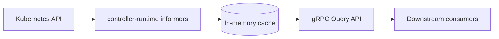
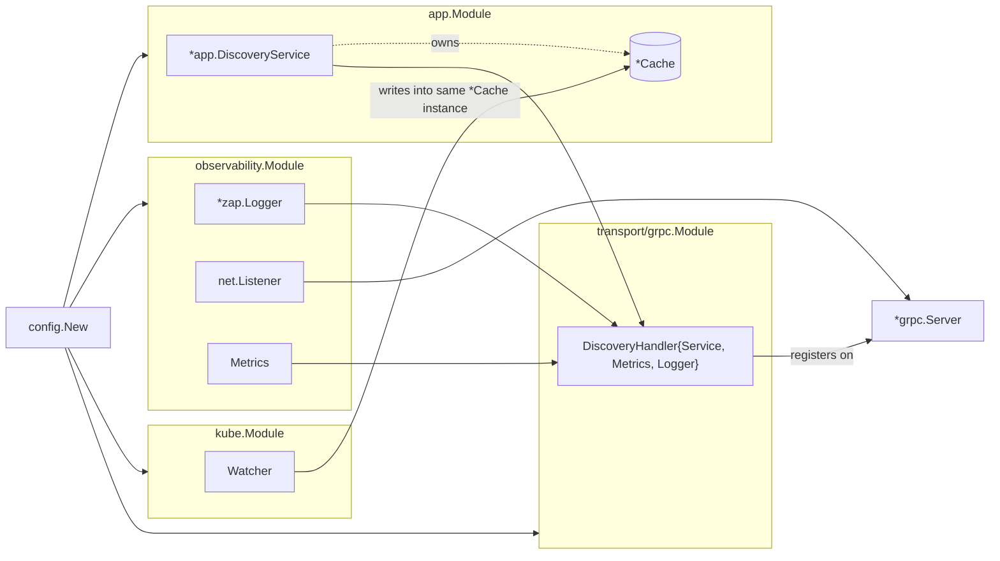

# Design

Full rationale behind Muninn's architecture — the "why," not just the "what."
The README covers the high-level shape; this doc exists to defend every
decision below on its own terms.

---

## Architecture overview

Three CRDs, all under group `muninn.io`, namespace `tenant-<id>`:

- **Tenant** (cluster-scoped) — identity, lifecycle phase, provisioned cloud
  resource refs.
- **TenantConfig** (namespace-scoped) — arbitrary `map[string]string` runtime
  config.
- **Policy** (namespace-scoped) — JWT validation settings, subject/role
  bindings.

---

## Patch-based cache merge

Each CRD owns its own slice of a tenant's cached `TenantState` — a `Policy`
update never touches `TenantConfig` data, and vice versa. Each informer
handler builds a `tenantPatch` containing only the fields it's responsible
for, and `applyPatch` (`internal/kube/watcher.go`) merges that patch into the
existing cache entry rather than replacing it wholesale.

Without this, any single CRD's informer event would have to either know
about the other two CRDs' shapes (tight coupling) or overwrite the full
`TenantState` (data loss on partial updates). Patch-based merge means each
watcher stays ignorant of the other two.

Covered directly in `internal/kube/watcher_test.go`
(`TestApplyPatch_ResourceScopedMerge`).

### Tenant deletion is the one exception

Muninn never deletes Kubernetes objects itself — this is entirely about
keeping the cache consistent after something else deletes a `Tenant`.

`onTenantDelete` doesn't go through `applyPatch` at all — it calls
`Cache.Delete` directly, removing the entry unconditionally, regardless of
whether `TenantConfig`/`Policy` data for that tenant is still cached.

This is deliberately asymmetric with `onTenantConfigDelete`/`onPolicyDelete`,
which *do* go through `applyPatch` and only clear their own field. The
difference is what each CRD's absence actually means: a `Tenant` can
legitimately exist with no `TenantConfig`/`Policy` yet (a normal lifecycle
state, not a problem), but `TenantConfig`/`Policy` outliving their `Tenant` is
an orphan — Kubernetes has no `ownerReferences` cascade wired between these
three independent CRDs, so a `TenantConfig` or `Policy` object can physically
remain in the cluster after its `Tenant` is deleted. `Tenant` is the identity
anchor (cluster-scoped: identity, phase, cloud resource refs); once it's
gone, continuing to serve `Query` results assembled from those orphaned
records would answer for a tenant that, identity-wise, no longer exists —
worse than just returning `NotFound`.

The `ownerReferences`-based fix (letting the Kubernetes garbage collector
cascade-delete `TenantConfig`/`Policy` when their `Tenant` is deleted) is out
of Muninn's control: Muninn only watches these CRDs, it doesn't create them.
Provisioning — creating `Tenant`/`TenantConfig`/`Policy` objects and the cloud
resources behind them — is a separate system's responsibility; Muninn is a
read-only discovery service, never a write path. That's also why no owner
reference exists between these three CRDs in the first place: setting one
would be the provisioning system's job, not something a watcher can retrofit.

Verified by `test/integration/envtest/watcher_test.go`'s
`TestWatcherProjection`, which asserts that arasaka's orphaned
`TenantConfig`/`Policy` don't prevent full removal once its `Tenant` is
deleted.

## Readiness gating

The gRPC health check stays `NOT_SERVING` until the informer cache completes
its initial list+watch cycle. Flipped via `MarkHealthServing` once
`Watcher.Start` confirms sync, backed by `atomic.Bool` so the flag is safe to
read from the gRPC goroutines and write from the informer's sync callback
without a lock.

Without this, a freshly-started pod would return `NotFound` for tenants that
genuinely exist but simply haven't been listed into cache yet — a false
negative that's indistinguishable from "tenant doesn't exist" to a caller.

## Key whitelisting

`internal/app.SupportedKeys` is the single source of truth for what's
queryable. A key not in that map returns `InvalidArgument`, not a
silent/empty response. The `Describe` RPC exposes the full list with type
hints, so consumers discover the contract instead of guessing at internal
field names.

This is what makes the key namespace a stable API rather than a leak of
whatever happens to be on the CRD structs today — downstream consumers can't
accidentally depend on a field that isn't part of the contract.

## CloudResources on `Tenant.Status`, not `TenantConfig`

Provisioned infrastructure refs (identity pool ID/ARN, storage bucket name)
live on `Tenant.Status.CloudResources`, not inside `TenantConfig`'s
`map[string]string`. They belong to tenant *lifecycle* — set once during
provisioning, changed rarely, owned by whatever controller provisions cloud
resources — not to arbitrary runtime config that operators edit directly.
Mixing the two would blur who's allowed to write what.

## Tenant resolved at request-time

`Query` takes a tenant ID on every call and resolves it from cache fresh each
time, rather than a client pinning a tenant context once at connection setup.
This avoids stale state in long-lived client connections — a tenant's cache
entry can change between two calls on the same connection, and the caller
always sees current state without needing to reconnect or invalidate
anything client-side.

## Domain / transport boundary

`internal/app` is the domain layer. `DiscoveryService.Query` speaks only
primitives and domain types — no `grpc`, `codes`, `status`, or generated
proto types appear anywhere in the package. This is compiler-enforced:
`internal/app` has zero imports of anything transport-related, so a leaky
implementation can't sneak a proto type through the way it could past an
interface boundary alone.

Both edges do translation work — `internal/kube` translates CRDs *in*,
`internal/transport/grpc` translates requests *out* — and the domain package
stays ignorant of both.

### No `Querier` interface

`internal/transport/grpc/handler.go` holds a concrete `*app.DiscoveryService`
field, not an interface — despite Go's idiomatic "accept interfaces" pattern
suggesting the handler should depend on a `Querier` it defines itself.

- **Testability doesn't need it.** `internal/transport/grpc/handler_test.go`
  constructs a real `app.NewDiscoveryService` and seeds it via
  `svc.Cache.Set(...)`, then asserts on the handler's proto output.
  `DiscoveryService` is cheap and deterministic (in-memory map, no I/O) —
  mocking it would just reimplement the `Query` switch statement badly.
  Interfaces earn their keep when the real implementation is
  expensive/non-deterministic (DB, network); this isn't.
- **Swapping transport doesn't need it either.** Because `internal/app` has
  zero knowledge of gRPC, adding e.g. `internal/transport/http` that also
  holds `*app.DiscoveryService` and translates JSON instead of protobuf
  touches zero lines in `internal/app`. The one-directional import boundary
  is what makes transport swappable, not the interface.

This gets revisited only if a second concrete `DiscoveryService`-like
implementation shows up (e.g. a caching decorator) — Go interfaces are
structural, so retrofitting one later costs nothing.

## Error translation

Domain sentinel errors (`internal/app/errors.go`) map to gRPC status codes
only inside `internal/transport/grpc`, via `errors.Is`:

| domain sentinel | gRPC code |
|---|---|
| `ErrTenantNotFound` | `NotFound` |
| `ErrUnsupportedKey`, `ErrTenantIDRequired`, `ErrStrictMissingKeys` | `InvalidArgument` |
| `ErrCacheNotSynced`, `ErrCacheEntryStale` | `Unavailable` |
| anything else | `Internal` |

`classifyError` must use `errors.Is`, not string/type matching —
`internal/app` wraps sentinels with `fmt.Errorf("%w: ...", Err...)` for
context, so equality checks would silently break classification.

## Fx module wiring

Each layer owns an `fx.Module`: `fx.Provide` for constructors, `fx.Invoke`
for lifecycle side effects (start watcher, start server). `cmd/muninn/main.go`
only lists modules — it doesn't know construction details, except for the
gRPC server itself.

`app.Module` provides `*DiscoveryService` (which owns `Cache`), then
re-exposes `*Cache` on its own so `kube.Module`'s `Watcher` gets injected the
*same* cache instance to write into. This is the only place domain and
K8s-informer code touch — through the `Cache` type, never through each
other's packages.

The `*grpc.Server` itself is constructed in `cmd/muninn/main.go` (the
composition root), not inside `observability.Module` or
`transport/grpc.Module` — avoids an import cycle (interceptors live in
`transport/grpc`, base listener/health lives in `observability`; something
above both has to wire them together).

## In-cluster deployment (`config/manager/`, `config/rbac/`)

Muninn deploys under its own least-privilege `ServiceAccount`
(`config/manager/deployment.yaml`, `config/rbac/`), not the cluster-admin
permissions convenient for local development.

### `ClusterRole`, not `Role`, for namespace-scoped CRDs

`TenantConfig`/`Policy` are namespace-scoped, but they live across a
dynamically-created namespace *per tenant* (`tenant-<id>`) — there's no fixed
namespace to bind a `Role`/`RoleBinding` to. A `ClusterRole` bound via
`ClusterRoleBinding` is the correct pattern for a watcher whose namespaced
resources span an open-ended, growing set of namespaces, even though the
resources themselves aren't cluster-scoped. `Tenant` (genuinely
cluster-scoped) and `TenantConfig`/`Policy` (namespace-scoped but
multi-namespace) end up needing the same kind of binding for different
reasons — one `ClusterRole` covers all three, since they share the
`muninn.io` API group.

`role.yaml` doesn't grant `tenants/status` — that subresource permission
only matters for *writing* status (or a direct GET on the status subresource
endpoint). The watcher only ever does `get`/`list`/`watch` on the base
resources via `controller-runtime`'s informer cache, which already returns
the full object including `.status`.

### No leader-election RBAC

kubebuilder scaffolds `leader_election_role.yaml` by default because a
reconciling controller needs exactly one active replica holding a lock.
Muninn isn't a reconciler — it's a stateless read-through cache. Multiple
replicas each independently watch and serve without coordination, so there's
no lock to grant RBAC for.

### Readiness probe wired to the actual health service

`deployment.yaml`'s `readinessProbe`/`livenessProbe` use Kubernetes' native
gRPC probe (`grpc: {port: 5011}`, stable since 1.24) against the same health
server the "Readiness gating" design decision above describes. A pod whose
informer cache hasn't finished its initial sync is held out of rotation by
Kubernetes itself, not just by an internal flag nothing outside the process
reads.

### `securityContext` matches the `distroless:nonroot` image

`runAsNonRoot: true`, `readOnlyRootFilesystem: true`,
`allowPrivilegeEscalation: false`, `capabilities: {drop: ["ALL"]}` — Pod-level
enforcement of the same hardening the `gcr.io/distroless/static:nonroot` base
image already provides by default. The image runs non-root on its own, but
the cluster enforces it independently rather than relying on image behavior
alone.

### Image reference must match what `make load` produces exactly

`imagePullPolicy: Never` requires an exact string match against what's
already in the node's containerd store. `make load` (`podman save | k3s ctr
images import -`) preserves Podman's own local tag, `localhost/muninn:latest`
— not `muninn:latest`. `deployment.yaml` references the full
`localhost/muninn:latest` for this reason; containerd does an exact lookup
under `Never`, not a fuzzy one, so the shorter form fails with
`ErrImageNeverPull`.

## End-to-end deployment test (`test/e2e`)

`test/e2e/e2e_test.go` deploys Muninn against a real cluster and exercises it
over the actual gRPC wire protocol, verifying the container image, the
`ClusterRole` scope, and the readiness probe all work together in practice —
none of which a throwaway `envtest` control plane can check.

The test deploys and tears down by running `make deploy`/`make undeploy` as
subprocesses, rather than applying the manifests via `controller-runtime`'s
client directly (the pattern `test/integration/envtest` uses for its own
fixtures). This exercises the same deploy path a person runs by hand.

The image must already be built and loaded (`make image load`) before
running this test — it doesn't do either itself, since `make load` requires
interactive `sudo`, which a test process has no way to satisfy. If the image
isn't loaded, the Pod's containers sit in `ErrImageNeverPull`; the test
detects that specific condition and skips with a message naming the missing
step, rather than failing on an unrelated-looking timeout.

Reaching the Pod goes through `k8s.io/client-go/tools/portforward`, used
directly rather than a `kubectl port-forward` subprocess — the library
manages the tunnel's readiness and shutdown safely, which a background
process would require additional supervision code to guarantee.

Assertions go through `discoveryv1.DiscoveryServiceClient` against structured
`QueryResponse` fields, not `muninnctl`'s CLI output — `muninnctl`'s
formatting already has its own unit test coverage
(`cmd/muninnctl/main_test.go`); this test verifies the deployed server's
actual responses over the network.

This test runs locally only (`make test-e2e`), not in CI. A full CI job would
need a real k3s cluster provisioned in the runner — installing k3s, building
and importing the image, deploying, querying, tearing down — a much heavier
and slower job than `envtest`'s two-binaries-and-go-test setup, for a
portfolio project where a live demo already covers the same signal.

