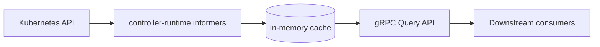
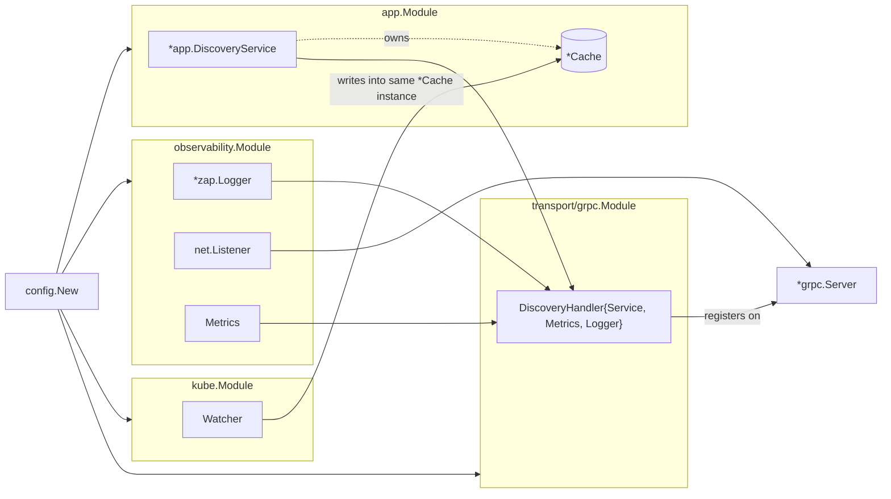

# Design

Full rationale behind Muninn's architecture — the "why," not just the "what."
The README covers the high-level shape; this doc exists to defend every
decision below on its own terms.

---

## Architecture overview

Three CRDs, all under group `muninn.io`, namespace `tenant-<id>`:

- **Tenant** (cluster-scoped) — identity, lifecycle phase, provisioned cloud
  resource refs.
- **TenantConfig** (namespace-scoped) — arbitrary `map[string]string` runtime
  config.
- **Policy** (namespace-scoped) — JWT validation settings, subject/role
  bindings.

---

## Patch-based cache merge

Each CRD owns its own slice of a tenant's cached `TenantState` — a `Policy`
update never touches `TenantConfig` data, and vice versa. Each informer
handler builds a `tenantPatch` containing only the fields it's responsible
for, and `applyPatch` (`internal/kube/watcher.go`) merges that patch into the
existing cache entry rather than replacing it wholesale.

Without this, any single CRD's informer event would have to either know
about the other two CRDs' shapes (tight coupling) or overwrite the full
`TenantState` (data loss on partial updates). Patch-based merge means each
watcher stays ignorant of the other two.

Covered directly in `internal/kube/watcher_test.go`
(`TestApplyPatch_ResourceScopedMerge`).

## Readiness gating

The gRPC health check stays `NOT_SERVING` until the informer cache completes
its initial list+watch cycle. Flipped via `MarkHealthServing` once
`Watcher.Start` confirms sync, backed by `atomic.Bool` so the flag is safe to
read from the gRPC goroutines and write from the informer's sync callback
without a lock.

Without this, a freshly-started pod would return `NotFound` for tenants that
genuinely exist but simply haven't been listed into cache yet — a false
negative that's indistinguishable from "tenant doesn't exist" to a caller.

## Key whitelisting

`internal/app.SupportedKeys` is the single source of truth for what's
queryable. A key not in that map returns `InvalidArgument`, not a
silent/empty response. The `Describe` RPC exposes the full list with type
hints, so consumers discover the contract instead of guessing at internal
field names.

This is what makes the key namespace a stable API rather than a leak of
whatever happens to be on the CRD structs today — downstream consumers can't
accidentally depend on a field that isn't part of the contract.

## CloudResources on `Tenant.Status`, not `TenantConfig`

Provisioned infrastructure refs (identity pool ID/ARN, storage bucket name)
live on `Tenant.Status.CloudResources`, not inside `TenantConfig`'s
`map[string]string`. They belong to tenant *lifecycle* — set once during
provisioning, changed rarely, owned by whatever controller provisions cloud
resources — not to arbitrary runtime config that operators edit directly.
Mixing the two would blur who's allowed to write what.

## Tenant resolved at request-time

`Query` takes a tenant ID on every call and resolves it from cache fresh each
time, rather than a client pinning a tenant context once at connection setup.
This avoids stale state in long-lived client connections — a tenant's cache
entry can change between two calls on the same connection, and the caller
always sees current state without needing to reconnect or invalidate
anything client-side.

## Domain / transport boundary

`internal/app` is the domain layer. `DiscoveryService.Query` speaks only
primitives and domain types — no `grpc`, `codes`, `status`, or generated
proto types appear anywhere in the package. This is compiler-enforced:
`internal/app` has zero imports of anything transport-related, so a leaky
implementation can't sneak a proto type through the way it could past an
interface boundary alone.

Both edges do translation work — `internal/kube` translates CRDs *in*,
`internal/transport/grpc` translates requests *out* — and the domain package
stays ignorant of both.

### No `Querier` interface

`internal/transport/grpc/handler.go` holds a concrete `*app.DiscoveryService`
field, not an interface — despite Go's idiomatic "accept interfaces" pattern
suggesting the handler should depend on a `Querier` it defines itself.

- **Testability doesn't need it.** `internal/transport/grpc/handler_test.go`
  constructs a real `app.NewDiscoveryService` and seeds it via
  `svc.Cache.Set(...)`, then asserts on the handler's proto output.
  `DiscoveryService` is cheap and deterministic (in-memory map, no I/O) —
  mocking it would just reimplement the `Query` switch statement badly.
  Interfaces earn their keep when the real implementation is
  expensive/non-deterministic (DB, network); this isn't.
- **Swapping transport doesn't need it either.** Because `internal/app` has
  zero knowledge of gRPC, adding e.g. `internal/transport/http` that also
  holds `*app.DiscoveryService` and translates JSON instead of protobuf
  touches zero lines in `internal/app`. The one-directional import boundary
  is what makes transport swappable, not the interface.

This gets revisited only if a second concrete `DiscoveryService`-like
implementation shows up (e.g. a caching decorator) — Go interfaces are
structural, so retrofitting one later costs nothing.

## Error translation

Domain sentinel errors (`internal/app/errors.go`) map to gRPC status codes
only inside `internal/transport/grpc`, via `errors.Is`:

| domain sentinel | gRPC code |
|---|---|
| `ErrTenantNotFound` | `NotFound` |
| `ErrUnsupportedKey`, `ErrTenantIDRequired`, `ErrStrictMissingKeys` | `InvalidArgument` |
| `ErrCacheNotSynced`, `ErrCacheEntryStale` | `Unavailable` |
| anything else | `Internal` |

`classifyError` must use `errors.Is`, not string/type matching —
`internal/app` wraps sentinels with `fmt.Errorf("%w: ...", Err...)` for
context, so equality checks would silently break classification.

## Fx module wiring

Each layer owns an `fx.Module`: `fx.Provide` for constructors, `fx.Invoke`
for lifecycle side effects (start watcher, start server). `cmd/muninn/main.go`
only lists modules — it doesn't know construction details, except for the
gRPC server itself.

`app.Module` provides `*DiscoveryService` (which owns `Cache`), then
re-exposes `*Cache` on its own so `kube.Module`'s `Watcher` gets injected the
*same* cache instance to write into. This is the only place domain and
K8s-informer code touch — through the `Cache` type, never through each
other's packages.

The `*grpc.Server` itself is constructed in `cmd/muninn/main.go` (the
composition root), not inside `observability.Module` or
`transport/grpc.Module` — avoids an import cycle (interceptors live in
`transport/grpc`, base listener/health lives in `observability`; something
above both has to wire them together).

